An Introduction to the GCol Library
===================================

In this chapter, we demonstrate the functionality of the ``gcol``
library’s routines using both textual and graphical output. If you have
not done so already, the ``gcol`` library should first be installed by
typing the following at the command line:
``python -m pip install gcol``, or executing the following command in a
notebook: ``!python -m pip install gcol``, and then restarting the
kernel.

Let us first review some basic terminology in graph theory.

- A
  `graph <https://en.wikipedia.org/wiki/Graph_(discrete_mathematics)>`__
  is an object comprising a set of nodes that are linked by edges. They
  be can visualized in diagram form, as shown below. Graphs are
  sometimes known as *networks*; nodes are sometimes called *vertices*.
- A `node coloring <https://en.wikipedia.org/wiki/Graph_coloring>`__ of
  a graph is an assignment of colors to nodes so that all pairs of
  adjacent nodes have different colors. The aim is to use as few colors
  as possible. The smallest number of colors needed to color the nodes
  of a graph :math:`G` is known as the graph’s chromatic number, denoted
  by :math:`\chi(G)`. Identifying :math:`\chi(G)` is NP-hard.
- An `edge coloring <https://en.wikipedia.org/wiki/Edge_coloring>`__ of
  a graph is an assignment of colors to edges so that all pairs of
  adjacent edges have different colors (a pair of edges is considered
  adjacent if and only if they share a common endpoint). The aim is to
  use as few colors as possible. The smallest number of colors needed
  for coloring the edges of a graph :math:`G` is known as the graph’s
  chromatic index, denoted by :math:`\chi'(G)`. According to Vizing’s
  theorem, :math:`\chi'(G)` is either :math:`\Delta(G)` or
  :math:`\Delta(G) + 1`, where :math:`\Delta(G)` is the maximum degree
  in :math:`G`. However, identifying :math:`\chi'(G)` is still NP-hard.
- A face coloring of a planar graph is an assignment of colors to one of
  its `planar embeddings <https://en.wikipedia.org/wiki/Planar_graph>`__
  so that all pairs of adjacent faces have different colors. The aim is
  to use as few colors as possible. According to `Euler’s
  formula <https://en.wikipedia.org/wiki/Planar_graph#Euler's_formula>`__,
  an embedding of a planar graph with :math:`n` nodes and :math:`m`
  edges has exactly :math:`m-n+2` faces, including the external face.
  The smallest number of colors needed to color the faces of a planar
  embedding is known as its face chromatic number. Due to the `Four
  Color Theorem <https://en.wikipedia.org/wiki/Four_color_theorem>`__,
  the face chromatic number is always less than or equal to four. Note
  that non-planar graphs do not have embeddings.
- In the `node
  precoloring <https://en.wikipedia.org/wiki/Precoloring_extension>`__
  problem, some of the nodes have already been assigned colors. The aim
  is to allocate colors to the remaining nodes so that we get a full
  coloring that uses a minimum number of colors. The same concepts apply
  for the edge precoloring problem and face precoloring problem.

Getting Started
---------------

We start by importing the libraries we need. The ``networkx`` library is
used to generate and visualize the graphs, the ``matplotlib.pyplot`` is
used to render the drawings, and the ``gcol`` library contains all of
our graph coloring routines.

.. code:: ipython3

    import networkx as nx              # python library for graph theory
    import matplotlib.pyplot as plt    # python library for visualization  
    import gcol                        # the gcol library

Having imported the relevant libraries, the following code generates a
`dodecahedron
graph <https://en.wikipedia.org/wiki/Regular_dodecahedron>`__ and draws
it to the screen.

.. code:: ipython3

    G = nx.dodecahedral_graph()
    nx.draw_networkx(G, pos=nx.spring_layout(G, seed=1))
    plt.show()

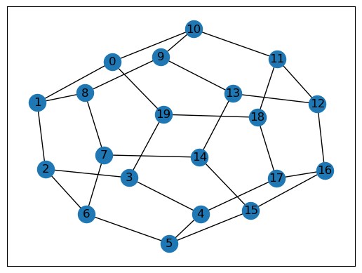

Now that we have defined a graph, we can easily color it using
``gcol``\ ’s routines. The example below shows how to use the
``gcol.node_coloring()`` routine to color the nodes of ``G``. Some
information about this coloring is then written to the screen, along
with a visualization. The colors of the nodes are held in the dictionary
``c``, using the integers ``0,1,2,...`` as color labels. We can also
write the coloring as a partition, which groups all nodes of the same
color. Note that pairs of adjacent nodes are always painted with
different colors, as required.

.. code:: ipython3

    G = nx.dodecahedral_graph()
    c = gcol.node_coloring(G)
    
    print("Here is a node coloring of the above graph:", c)
    print("The number of colors in this solution is:", max(c.values()) + 1)
    print("Here is the same solution, expressed as a partition of the nodes:", gcol.partition(c))
    
    print("Here is a picture of this coloring:")
    nx.draw_networkx(G, 
                     pos=nx.spring_layout(G, seed=1), 
                     node_color=gcol.get_node_colors(G, c))
    plt.show()

.. parsed-literal::

    Here is a node coloring of the above graph: {0: 0, 1: 1, 19: 1, 10: 1, 2: 0, 3: 2, 8: 0, 9: 2, 18: 0, 11: 2, 6: 1, 7: 2, 4: 0, 5: 2, 13: 0, 12: 1, 14: 1, 15: 0, 16: 2, 17: 1}
    The number of colors in this solution is: 3
    Here is the same solution, expressed as a partition of the nodes: [[0, 2, 4, 8, 13, 15, 18], [1, 6, 10, 12, 14, 17, 19], [3, 5, 7, 9, 11, 16]]
    Here is a picture of this coloring:
    

.. image:: output_6_1.png

We can also write similar commands to determine the chromatic number,
chromatic index, and face chromatic number of this graph.

.. code:: ipython3

    print("The chromatic number of this graph is:", gcol.chromatic_number(G))
    print("The chromatic index of this graph is:", gcol.chromatic_index(G))
    print("The face chromatic number of this graph is:", gcol.face_chromatic_number(G))

.. parsed-literal::

    The chromatic number of this graph is: 3
    The chromatic index of this graph is: 3
    The face chromatic number of this graph is: 4
    

Note that we are allowed to use the ``gcol.face_chromatic_number()``
method here, because the above graph can be represented as a `planar
embedding <https://en.wikipedia.org/wiki/Planar_graph>`__. (If the graph
does not have a planar embedding, an error will be raised.) Here is an
example planar embedding of the dodecahedral graph seen above. This is
merely a positioning of the nodes so that no edges cross in the
resultant visualization.

.. code:: ipython3

    G = nx.dodecahedral_graph()
    nx.draw_networkx(G, 
                     pos=nx.planar_layout(G),
                     node_size=100, 
                     font_size=8)
    plt.show()

Node Coloring and Visualization
-------------------------------

The previous example showed a node 3-coloring of the 20-node
dodecahedron graph. The positions of the nodes in the visualization have
been determined using the ``nx.spring_layout()`` routine from
``networkx``; however, we can also choose to position the nodes based on
their colors.

The first example below uses the routine ``gcol.coloring_layout()`` in
combination with ``nx.draw_networkx()`` to position the nodes in a ring
so that those of the same color are next to each other. Similarly, the
second example uses the routine ``gcol.multipartite_layout()`` to put
nodes of the same color into columns.

Note that, despite looking superficially different, the solutions shown
are the same as the previous example.

.. code:: ipython3

    G = nx.dodecahedral_graph()
    c = gcol.node_coloring(G)
    nx.draw_networkx(G, 
                     pos=gcol.coloring_layout(G, c), 
                     node_color=gcol.get_node_colors(G, c))
    plt.show()
    
    nx.draw_networkx(G, 
                     pos=gcol.multipartite_layout(G, c), 
                     node_color=gcol.get_node_colors(G, c))
    plt.show()

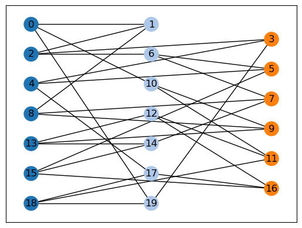

We will now do something similar with a larger graph. In the following,
the nodes of the graph ``G`` represent the different characters in the
play Les Miserables. Edges between nodes then indicate pairs of
characters that appear in the same scenes together.

.. code:: ipython3

    G = nx.les_miserables_graph()
    c = gcol.node_coloring(G, opt_alg=1)
    print("Number of colors =", max(c.values()) + 1)
    
    nx.draw_networkx(G, 
                     pos=nx.spring_layout(G, seed=1), 
                     node_color=gcol.get_node_colors(G, c), 
                     node_size=20, 
                     font_size=8, 
                     width=0.25)
    plt.show()

.. parsed-literal::

    Number of colors = 10
    

In the above, we have used the option ``opt_alg=1`` meaning that an
exact algorithm has been used to produce the optimal solution. The
output tells us that the nodes of ``G`` can be colored using a minimum
of ten colors. In this case, it means that it is possible to partition
the characters of Les Miserables into ten groups (but no fewer) so that
the characters in each group never appear together.

The visualization of the above graph appears rather cluttered, however,
so we might choose to position the nodes according to color and also
remove the node’s labels. This can be done using the following commands,
which show the same solution.

.. code:: ipython3

    nx.draw_networkx(G, 
                     pos=gcol.coloring_layout(G, c), 
                     node_color=gcol.get_node_colors(G, c), 
                     node_size=20, 
                     with_labels=False, 
                     width=0.25)
    plt.show()
    
    nx.draw_networkx(G, 
                     pos=gcol.multipartite_layout(G, c), 
                     node_color=gcol.get_node_colors(G, c), 
                     node_size=20, 
                     with_labels=False, 
                     width=0.25)
    plt.show()

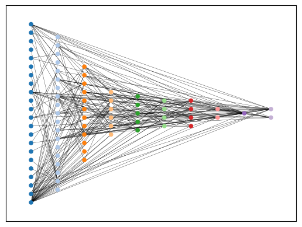

Color Palettes
--------------

So far, the colors used to display the above solutions have been taken
from the in-built default color palette ``gcol.tableau``, which maps the
integers :math:`0,1,2,\ldots` to RGB triplets. This palette is a
collection of 21 colors, provided by Tableau, that are intended to be
aesthetically pleasing and easy on the eye. However, other options are
available: ``gcol.colorful`` gives a collection of 57 bright colors that
are chosen to contrast each other as much as possible;
``gcol.colorblind`` gives eleven colors (also provided by Tableau) that
are intended to be easily distinguishable by those with colorblindness.
A demonstration of these palettes is now given.

.. code:: ipython3

    G = nx.dodecahedral_graph()
    c = gcol.node_coloring(G)
    nx.draw_networkx(G, 
                     pos=nx.spring_layout(G, seed=1), 
                     node_color=gcol.get_node_colors(G, c, palette=gcol.tableau))
    plt.show()
    
    nx.draw_networkx(G, 
                     pos=nx.spring_layout(G, seed=1), 
                     node_color=gcol.get_node_colors(G, c, palette=gcol.colorful))
    plt.show()
    
    nx.draw_networkx(G, 
                     pos=nx.spring_layout(G, seed=1), 
                     node_color=gcol.get_node_colors(G, c, palette=gcol.colorblind))
    plt.show()

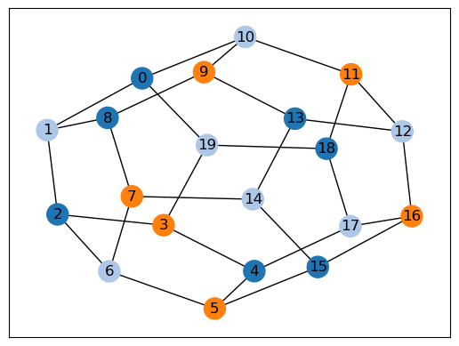

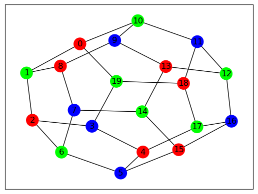

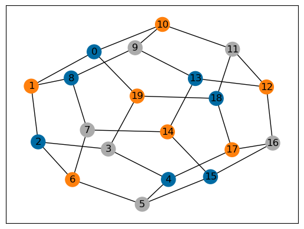

The following shows the colors that are available in each palette. These
are identified by the integers, starting from 0.

.. code:: ipython3

    G = nx.complete_graph(20)
    c = gcol.node_coloring(G)
    nx.draw_networkx(G, 
                     node_color=gcol.get_node_colors(G, c, gcol.tableau),
                     pos=gcol.coloring_layout(G, c),
                     node_size=600,
                     width=0.00)
    print("The (default) gcol.tableau palette (20 colors):")
    plt.show()
        
    G = nx.complete_graph(56)
    c = gcol.node_coloring(G)
    nx.draw_networkx(G, 
                     node_color=gcol.get_node_colors(G, c, gcol.colorful),
                     pos=gcol.coloring_layout(G, c),
                     node_size=150,
                     width=0.00)
    print("The gcol.colorful palette (56 colors):")
    plt.show()
        
    G = nx.complete_graph(10)
    c = gcol.node_coloring(G)
    nx.draw_networkx(G, 
                     node_color=gcol.get_node_colors(G, c, gcol.colorblind),
                     pos=gcol.coloring_layout(G, c),
                     node_size=800,
                     width=0.00)
    print("The gcol.colorblind palette (10 colors):")
    plt.show()

.. parsed-literal::

    The (default) gcol.tableau palette (20 colors):
    

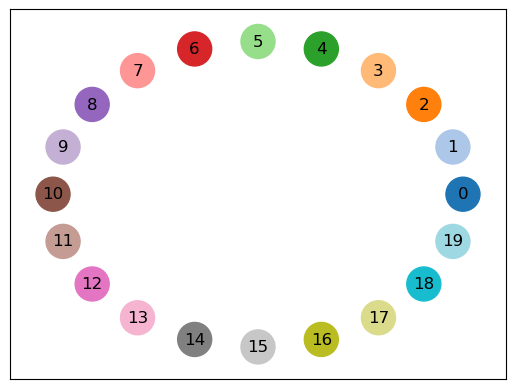

.. parsed-literal::

    The gcol.colorful palette (56 colors):
    

.. parsed-literal::

    The gcol.colorblind palette (10 colors):
    

User-defined palettes can also be created. The following demonstrates
how to create a greyscale palette based on the number of colors
:math:`k` in the current solution ``c``.

.. code:: ipython3

    def grayscale(k):
        minVal, maxVal, palette = 0.25, 0.85, {}
        step = (maxVal - minVal) / (k - 1)
        for i in range(k):
            x = minVal + step * i
            palette[i] = (x, x, x)
        palette[-1] = (1.0, 1.0, 1.0)
        return palette
    
    G = nx.dodecahedral_graph()
    c = gcol.node_coloring(G)
    k = max(c.values()) + 1
    print("Custom greyscale palette based on three colors:") 
    nx.draw_networkx(G, 
                     pos=nx.spring_layout(G, seed=1), 
                     node_color=gcol.get_node_colors(G, c, palette=grayscale(k)))
    plt.show()

.. parsed-literal::

    Custom greyscale palette based on three colors:
    

Edge Coloring and Visualization
-------------------------------

The following example shows how we can use the ``gcol`` library to color
the edges of a graph. As we have discussed, in edge coloring the maximum
degree :math:`\Delta(G)` in the graph :math:`G` gives a lower bound on
the chromatic index :math:`\chi'(G)`. Since :math:`\Delta(G)=3` and an
edge-3-coloring has been determined, we can conclude that this is an
optimal solution.

.. code:: ipython3

    G = nx.dodecahedral_graph()
    c = gcol.edge_coloring(G)
    print("Here is the color of each edge:", c)
    print("Here is the same solution, expressed as a partition of the edges:", gcol.partition(c))
    print("Maximum degree   =", max(G.degree(v) for v in G))
    print("Number of colors =", max(c.values()) + 1)
    
    nx.draw_networkx(G, 
                     pos=nx.spring_layout(G, seed=1), 
                     edge_color=gcol.get_edge_colors(G, c), 
                     width=5)

.. parsed-literal::

    Here is the color of each edge: {(11, 12): 0, (11, 18): 1, (10, 11): 2, (12, 16): 1, (12, 13): 2, (18, 19): 0, (17, 18): 2, (16, 17): 0, (4, 17): 1, (15, 16): 2, (0, 10): 0, (9, 10): 1, (9, 13): 0, (8, 9): 2, (13, 14): 1, (14, 15): 0, (5, 15): 1, (7, 14): 2, (0, 19): 1, (3, 19): 2, (0, 1): 2, (3, 4): 0, (2, 3): 1, (1, 2): 0, (2, 6): 2, (5, 6): 0, (4, 5): 2, (1, 8): 1, (6, 7): 1, (7, 8): 0}
    Here is the same solution, expressed as a partition of the edges: [[(0, 10), (1, 2), (11, 12), (14, 15), (16, 17), (18, 19), (3, 4), (5, 6), (7, 8), (9, 13)], [(0, 19), (1, 8), (11, 18), (12, 16), (13, 14), (2, 3), (4, 17), (5, 15), (6, 7), (9, 10)], [(0, 1), (10, 11), (12, 13), (15, 16), (17, 18), (2, 6), (3, 19), (4, 5), (7, 14), (8, 9)]]
    Maximum degree   = 3
    Number of colors = 3
    

.. image:: output_24_1.png

Here is another example using a `complete
graph <https://en.wikipedia.org/wiki/Complete_graph>`__. Edge coloring
in complete graphs has applications in `sports league
scheduling <https://rhydlewis.eu/papers/sportsPaper.pdf>`__.

.. code:: ipython3

    G = nx.complete_graph(20)
    c = gcol.edge_coloring(G, opt_alg=1)
    print("Maximum degree   =", max(G.degree(v) for v in G))
    print("Number of colors =", max(c.values()) + 1)
    nx.draw_networkx(G, 
                     pos=nx.circular_layout(G), 
                     edge_color=gcol.get_edge_colors(G, c))

.. parsed-literal::

    Maximum degree   = 19
    Number of colors = 19
    

.. image:: output_26_1.png

Face Coloring and Visualization
-------------------------------

As noted earlier, a face coloring is an assignment of colors to each
face in a `planar
embedding <https://en.wikipedia.org/wiki/Planar_graph>`__ so all pairs
of adjacent faces have different colors. Since non-planar graphs do not
have planar embeddings, the following routines are only suitable for
planar graphs. Planar graphs featuring
`bridges <https://en.wikipedia.org/wiki/Bridge_(graph_theory)>`__ are
also disallowed, as these give faces that are adjacent to themselves. In
the ``gcol`` library, face colorings of an embedding are determined by
node-coloring its `dual
graph <https://en.wikipedia.org/wiki/Dual_graph>`__.

Below, we generate a two-dimensional `grid
graph <https://en.wikipedia.org/wiki/Lattice_graph>`__ ``G``. In
``pos``, we also specify suitable :math:`(x,y)` coordinates for each
node. These positions define the planar embedding. After determining a
face coloring ``c``, it is drawn to the screen using the
``gcol.draw_face_coloring()`` method. By default, the external face is
not colored in the first visualization; however, we can change this by
setting ``external=True``, as shown in the second figure. The second
figure also shows how the original graph can be added to the image to
show the boundaries of each face.

Here, the regular structure of grid graphs has allowed us to easily
generate positions for each node. In some cases, however, a method of
doing this may not be obvious. The third example therefore demonstrates
how positions for each node can be determined using the NetworkX command
``nx.planar_layout()``. This arranges the nodes in a mountain-like
shape.

.. code:: ipython3

    G = nx.grid_2d_graph(10, 10)
    pos = dict((u, u) for u in G.nodes())
    c = gcol.face_coloring(G, pos)
    
    gcol.draw_face_coloring(c, pos)
    plt.show()
    
    gcol.draw_face_coloring(c, pos, external= True)
    nx.draw_networkx(G,
                     pos=pos,
                     node_color='k',
                     node_size=20,
                     with_labels=False)
    plt.show()
    
    pos = nx.planar_layout(G)
    c = gcol.face_coloring(G, pos)
    gcol.draw_face_coloring(c, pos, external=True)
    plt.show()
    
    print("Face chromatic number =", gcol.face_chromatic_number(G))

.. image:: output_28_2.png

.. parsed-literal::

    Face chromatic number = 3
    

The next example shows how we can use these routines to four-color the
departments of France using the data from the file
`france.txt <https://github.com/Rhyd-Lewis/GCol/blob/main/docs/demo/france.txt>`__.
Here, each node is assigned the attribute ``pos``, so the command
``nx.get_node_attributes()`` is used to form the positions dictionary.

.. code:: ipython3

    G = nx.Graph()
    with open("france.txt", "r") as f:
        f.readline()
        n = int(f.readline())
        for i in range(n):
            L = f.readline().split(" ")
            G.add_node(i, pos=(float(L[0]),float(L[1])))
            for j in range(2, len(L)):
                G.add_edge(i, int(L[j]))
    
    pos = nx.get_node_attributes(G, "pos")
    c = gcol.face_coloring(G, pos, opt_alg=1)
    gcol.draw_face_coloring(c, pos, external=True)
    nx.draw_networkx(G,
                     pos=pos,
                     node_color='k',
                     node_size=5,
                     with_labels=False)
    plt.show()

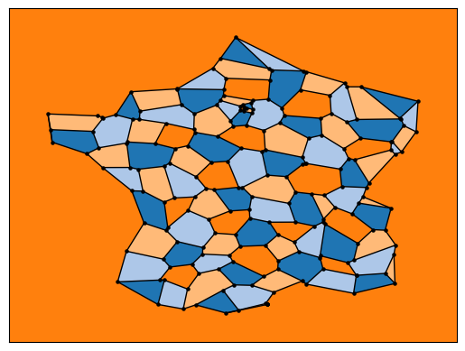

Precoloring
-----------

As mentioned earlier, in the node precoloring problem some of the nodes
have already been assigned colors. The aim is to assign colors to the
remaining nodes so that we get a full coloring that uses a minimum
number of colors. In the following example, the dictionary ``P`` is used
to assign nodes 0, 1, 8, 9 and 10 to colors 0, 1, 2, 3, and 1,
respectively. This partial coloring is then shown, together with a
corresponding full coloring.

.. code:: ipython3

    G = nx.dodecahedral_graph()
    P = {0:0, 1:1, 8:2, 9:3, 10:1}
    nx.draw_networkx(G, 
                     pos=nx.spring_layout(G, seed=1), 
                     node_color=gcol.get_node_colors(G, P))
    plt.show()
    
    c = gcol.node_precoloring(G, P, strategy="random", opt_alg=2, it_limit=100)
    nx.draw_networkx(G, 
                     pos=nx.spring_layout(G, seed=1), 
                     node_color=gcol.get_node_colors(G, c))
    plt.show()

A similar process can also be followed for edge precoloring, which the
following example demonstrates. Note that, when defining edges in the
dictionary ``P``, the endpoints must be given in the order used by
NetworkX. For example, in the example below, using ``(1,0):0`` in ``P``
instead of ``(0,1):0`` will raise a ``ValueError``.

.. code:: ipython3

    G = nx.dodecahedral_graph()
    P = {(0, 1): 0, (7, 8): 1, (13, 14): 1, (11, 12): 2, (15, 16): 3}
    nx.draw_networkx(G, 
                     pos=nx.spring_layout(G, seed=1), 
                     edge_color=gcol.get_edge_colors(G, P), 
                     width=5)
    plt.show()
    
    c = gcol.edge_precoloring(G, P, strategy="random", opt_alg=2, it_limit=100)
    nx.draw_networkx(G, 
                     pos=nx.spring_layout(G, seed=1), 
                     edge_color=gcol.get_edge_colors(G, c), 
                     width=5)
    plt.show()

We can also precolor the faces of a planar embedding. To do this we
follow the same process as the previous examples, though precolored
faces are now identified by using one or more of their surrounding arcs.
As the example below demonstrates, each internal face in a planar
embedding is characterized by the series of arcs that surround it *in a
counterclockwise direction*. Similarly, the one external face is
identified by the series of arcs traveling in *a clockwise direction*.
Including one of these surrounding arcs in the precoloring is
sufficient.

The following example creates a 20-node planar graph. It then precolors
two internal faces with color 0, and the external face with color 1.

.. code:: ipython3

    def make_planar_graph(n, seed=None):
        # Function for making a dense planar graph by placing nodes randomly
        # into the unit square, including corners
        assert n >= 4, "n parameter must be at least 4"
        import random
        from scipy.spatial import Delaunay
        random.seed(seed)
        P = [(0,0), (1,0), (0,1), (1, 1)]
        for i in range(4, n):
            P.append((random.uniform(0.05,0.95), random.uniform(0.05,0.95)))
        T = Delaunay(P).simplices.copy()
        G = nx.Graph()
        for v in range(n):
            G.add_node(v, pos=(P[v][0], P[v][1]))
        for x, y, z in T:
            G.add_edges_from([(x, y), (x, z), (y, z)])
        return G
    
    G = make_planar_graph(20, seed=1)
    pos = nx.get_node_attributes(G, "pos")
    
    P = {(14,16): 0, (9,3): 0, (2,3): 1}
    c = gcol.face_precoloring(G, pos, P, opt_alg=1)
    print(c)
    gcol.draw_face_coloring(c, pos, True)
    nx.draw_networkx(G, pos=pos, node_size=180, with_labels=True)
    plt.show()

.. parsed-literal::

    {(1, 0, 2, 3): 1, (8, 0, 10): 1, (17, 0, 8): 0, (14, 0, 17): 2, (2, 0, 14): 0, (10, 0, 1): 0, (15, 1, 3): 0, (13, 1, 15): 2, (10, 1, 13): 1, (4, 2, 14): 1, (12, 2, 4): 2, (3, 2, 12): 0, (7, 3, 12): 1, (9, 3, 7): 0, (15, 3, 9): 1, (16, 4, 14): 0, (11, 4, 16): 1, (12, 4, 11): 0, (9, 5, 15): 0, (6, 5, 9): 2, (19, 5, 6): 0, (10, 5, 19): 1, (13, 5, 10): 0, (15, 5, 13): 1, (11, 6, 7): 0, (18, 6, 11): 1, (16, 6, 18): 0, (19, 6, 16): 1, (7, 6, 9): 1, (11, 7, 12): 2, (17, 8, 19): 1, (19, 8, 10): 0, (18, 11, 16): 2, (16, 14, 17): 1, (19, 16, 17): 0}
    

Solving Sudoku
--------------

Node precoloring can also be used to solve `sudoku
puzzles <https://en.wikipedia.org/wiki/Sudoku>`__. The objective in
sudoku is to fill a :math:`d^2 \times d^2` grid with digits so that each
column, each row, and each of the :math:`d \times d` boxes contain all
of the digits from :math:`0` to :math:`d^2-1`. The puzzle comes with
some of the cells filled. The player then needs to fill the remaining
cells while satisfying the above constraints. Here is an example puzzle
using :math:`d=3` and the digits :math:`0,1,\ldots,8`. Blank cells are
marked by dots.

.. math::

   \begin{pmatrix}
   . & . & . & . & 5 & . & . & . & . \\ 
   . & . & 8 & . & 1 & . & . & . & . \\
   . & . & . & . & . & . & . & 1 & 2 \\ 
   . & 7 & . & . & . & 2 & . & . & . \\ 
   . & . & . & 6 & . & . & . & . & . \\ 
   . & 4 & . & . & . & 0 & . & 3 & . \\ 
   . & 5 & . & . & . & . & . & . & . \\ 
   . & . & . & . & 2 & . & 6 & . & . \\ 
   . & . & . & . & . & . & . & 2 & .
   \end{pmatrix}

Sudoku puzzles can be solved by first forming a `sudoku
graph <https://en.wikipedia.org/wiki/Sudoku_graph>`__, which uses a node
for each cell in the grid. Edges in this graph occur between all pairs
of nodes in the same column, row or box. Finally, we use the filled
cells in the puzzle to precolor the correct nodes. The puzzle is then
solved by coloring the remaining nodes using :math:`d^2` colors. The
following code shows how to solve the above puzzle.

.. code:: ipython3

    # Function for laying out the nodes of a (d**2 x d**2)-node sudoku puzzle 
    def sudoku_layout(G, d):
        pos = {}
        u = 0
        for i in range(d**2):
            for j in range(d**2):
                pos[u]=(j,-i)
                u += 1
        return pos
    
    G = nx.sudoku_graph(3)
    P = {4:5, 11:8, 13:1, 25:1, 26:2, 28:7, 32:2, 39:6, 46:4, 50:0, 52:3, 55:5, 67:2, 69:6, 79:2}
    print("Here is the sudoku puzzle from above")
    nx.draw_networkx(G, 
                     pos=sudoku_layout(G, 3), 
                     node_color=gcol.get_node_colors(G, P))
    plt.show()
    
    c = gcol.node_precoloring(G, P, opt_alg=1)
    print("Here is its solution. Number of colors =", max(c.values()) + 1)
    nx.draw_networkx(G, 
                     pos=sudoku_layout(G, 3), 
                     node_color=gcol.get_node_colors(G, c))
    plt.show()

.. parsed-literal::

    Here is the sudoku puzzle from above
    

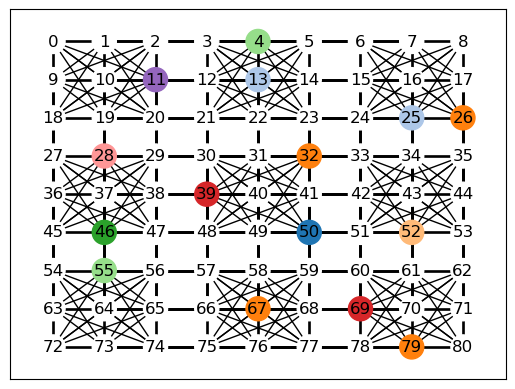

.. parsed-literal::

    Here is its solution. Number of colors = 9
    

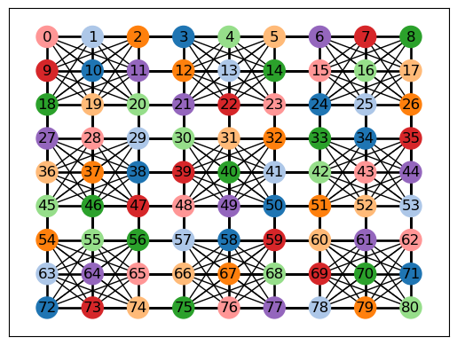

:math:`k`-Coloring
------------------

The :math:`k`-coloring problem is a version of the graph coloring
problem where the desired number of colors :math:`k` is stated
beforehand by the user. For node coloring, if :math:`k<\chi(G)`, then no
solution is possible; for edge coloring, if :math:`k < \chi'(G)`, then
no solution is possible. Several variants of the :math:`k`-coloring
problem can be formulated, including equitable coloring and weighted
graph coloring, using both weighted and unweighted graphs. Examples are
considered below.

In this first example, we make use of ``gcol.node_k_coloring()`` method
to produce node :math:`k`-colorings of a
`random <https://en.wikipedia.org/wiki/Erd%C5%91s%E2%80%93R%C3%A9nyi_model>`__
:math:`G(n,p)` graph. These graphs are generated by taking :math:`n`
nodes and then adding an edge between each pair of nodes at random with
probability :math:`p`. Here we use :math:`n=100` and :math:`p=0.05` with
:math:`k=6`, :math:`5`, and :math:`4`. For values of :math:`k<4`,
solutions are not possible and a ``ValueError`` will be returned.

.. code:: ipython3

    G = nx.gnp_random_graph(100, 0.05, seed=1)
    
    for k in [6, 5, 4]:
        c = gcol.node_k_coloring(G, k, opt_alg=2, it_limit=1000)
        print("Here is a node", k, "-coloring of G:")
        nx.draw_networkx(G, 
                         pos=nx.arf_layout(G), 
                         node_color=gcol.get_node_colors(G, c), 
                         node_size=100, 
                         font_size=8, 
                         width=0.25)
        plt.show()

.. parsed-literal::

    Here is a node 6 -coloring of G:
    

.. image:: output_40_1.png

.. parsed-literal::

    Here is a node 5 -coloring of G:
    

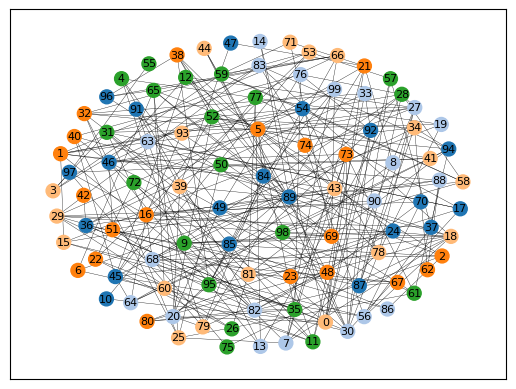

.. parsed-literal::

    Here is a node 4 -coloring of G:
    

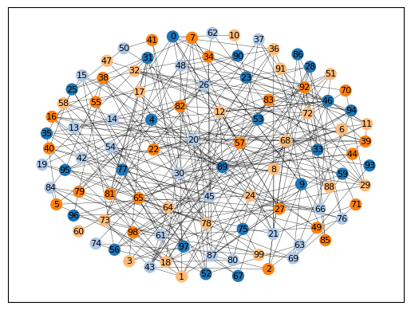

The following shows a similar process for edge :math:`k`-coloring.

.. code:: ipython3

    G = nx.dodecahedral_graph()
    
    for k in [5, 4, 3]:
        c = gcol.edge_k_coloring(G, k)
        print("Here is an edge", k, "-coloring of G:")
        nx.draw_networkx(G, 
                         pos=nx.spring_layout(G, seed=1), 
                         edge_color=gcol.get_edge_colors(G, c), 
                         width=5)
        plt.show()

.. parsed-literal::

    Here is an edge 5 -coloring of G:
    

.. parsed-literal::

    Here is an edge 4 -coloring of G:
    

.. parsed-literal::

    Here is an edge 3 -coloring of G:
    

Equitable :math:`k`-coloring
~~~~~~~~~~~~~~~~~~~~~~~~~~~~

In the equitable node :math:`k`-coloring problem we are seeking an
assignment of colors to nodes so that no two adjacent nodes have the
same color, and the number of nodes per-color is as uniform as possible.
We can also choose to define positive weights on the nodes, in which
case we are seeking a proper coloring in which the sum of the node
weights in each color is as uniform as possible.

The following example determines an equitable node :math:`5`-coloring
for a random :math:`G(100,0.05)` graph.

.. code:: ipython3

    G = nx.gnp_random_graph(100, 0.05, seed=1)
    
    print("Here is an equitable node-5-coloring of G,")
    c = gcol.equitable_node_k_coloring(G, 5, opt_alg=2, it_limit=1000)
    P = gcol.partition(c)
    print("Largest color class has", max(len(j) for j in P), "nodes")
    print("Smallest color class has", min(len(j) for j in P), "nodes")
    nx.draw_networkx(G, 
                     pos=nx.arf_layout(G), 
                     node_color=gcol.get_node_colors(G, c), 
                     node_size=100, 
                     font_size=8, 
                     width=0.25)
    plt.show()

.. parsed-literal::

    Here is an equitable node-5-coloring of G,
    Largest color class has 20 nodes
    Smallest color class has 20 nodes
    

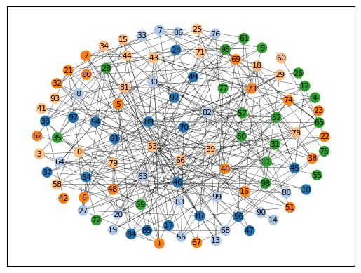

The following example also determines an equitable node
:math:`5`-coloring for a random :math:`G(100,0.05)` graph. However, in
this case, all nodes have been assigned weights randomly chosen from the
set :math:`\{1,2,\ldots,10\}`. The figure displays the weight of each
node, and the text gives the total weight of each color class.

.. code:: ipython3

    import random
    random.seed(1)
    
    H = nx.gnp_random_graph(100, 0.05, seed=1)
    G = nx.Graph()
    for u in H:
        G.add_node(u, weight=random.randint(1,10))
    for u,v in H.edges():
        G.add_edge(u, v)
    
    c = gcol.equitable_node_k_coloring(G, 5, weight="weight", opt_alg=2, it_limit=1000)
    print("Here is an equitable node 5-coloring of the node-weighted graph G:")
    P = gcol.partition(c)
    for j in range(len(P)):
        Wj = sorted([G.nodes[v]["weight"] for v in P[j]])
        print("Weight of color class", j, "=", sum(Wj), Wj)
    labels = {u: G.nodes[u]['weight'] for u in G.nodes}
    nx.draw_networkx(G,
                     pos=nx.arf_layout(G), 
                     node_color=gcol.get_node_colors(G, c), 
                     node_size=100, 
                     font_size=8, 
                     width=0.25, 
                     labels=labels)
    plt.show()
    

.. parsed-literal::

    Here is an equitable node 5-coloring of the node-weighted graph G:
    Weight of color class 0 = 115 [1, 2, 2, 3, 4, 6, 7, 8, 8, 8, 8, 9, 9, 10, 10, 10, 10]
    Weight of color class 1 = 115 [1, 1, 2, 2, 3, 4, 4, 4, 4, 5, 7, 7, 7, 8, 9, 9, 9, 9, 10, 10]
    Weight of color class 2 = 114 [1, 1, 1, 1, 3, 4, 5, 5, 6, 6, 7, 7, 7, 7, 8, 9, 9, 9, 9, 9]
    Weight of color class 3 = 114 [1, 2, 2, 2, 3, 3, 4, 4, 4, 5, 6, 6, 7, 7, 8, 8, 8, 8, 8, 8, 10]
    Weight of color class 4 = 114 [1, 1, 1, 1, 2, 3, 4, 4, 4, 5, 5, 5, 6, 6, 7, 7, 7, 8, 9, 9, 9, 10]
    

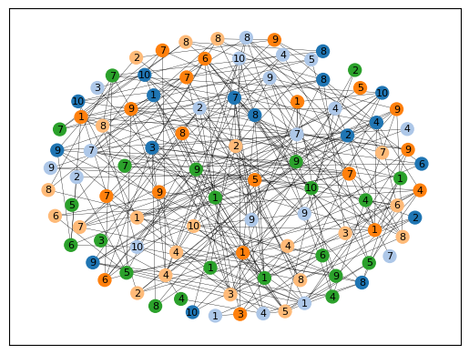

The same process can also be followed to produce equitable edge
:math:`k`-colorings, as the following demonstrates using an
edge-weighted graph.

.. code:: ipython3

    G = nx.dodecahedral_graph()
    for u, v in G.edges():
        G.add_edge(u, v, edgeweight=random.randint(1,5))
    
    c = gcol.equitable_edge_k_coloring(G, 3, weight="edgeweight", opt_alg=2, it_limit=1000)
    print("Here is an equitable edge-3-coloring of the edge-weighted graph G,")
    P = gcol.partition(c)
    for j in range(len(P)):
        Wj = sorted([G.edges[e]["edgeweight"] for e in P[j]])
        print("Weight of color class", j, "=", sum(Wj), Wj)
        
    pos = nx.spring_layout(G, seed=1)
    nx.draw_networkx(G, pos=pos, edge_color=gcol.get_edge_colors(G, c), width=5)
    labels = nx.get_edge_attributes(G,'edgeweight')
    nx.draw_networkx_edge_labels(G, pos=pos, edge_labels=labels)
    plt.show()

.. parsed-literal::

    Here is an equitable edge-3-coloring of the edge-weighted graph G,
    Weight of color class 0 = 37 [1, 1, 2, 4, 4, 5, 5, 5, 5, 5]
    Weight of color class 1 = 38 [1, 3, 3, 4, 4, 4, 4, 5, 5, 5]
    Weight of color class 2 = 37 [2, 2, 3, 3, 3, 4, 5, 5, 5, 5]
    

The next example shows an equitable face coloring using 6 colors.

.. code:: ipython3

    G = make_planar_graph(500, seed=1)
    pos = nx.get_node_attributes(G, "pos")
    c = gcol.equitable_face_k_coloring(G, pos, k=6)
    gcol.draw_face_coloring(c, pos, True)
    nx.draw_networkx(G, pos=pos, node_size=0, with_labels=False)
    plt.show()

Minimum Cost :math:`k`-Coloring
~~~~~~~~~~~~~~~~~~~~~~~~~~~~~~~

Sometimes we will be seeking a node :math:`k`-coloring, but are willing
to allow some nodes to remain uncolored. This is particularly useful
when using a value for :math:`k` that is less than the graph’s chromatic
number :math:`\chi(G)`. In such cases, we are seeking to minimize the
number of uncolored nodes, while ensuring that adjacent colored nodes
never have the same color. We might also choose to add positive weights
to the nodes, in which case we will seek to minimize the sum of the
weights of the uncolored nodes.

The following example creates a node-weighted random graph and then
produces a node 3-coloring solution using the routine
``gcol.min_cost_k_coloring()``. This solution has five uncolored nodes
with a total weight of six. In the visualization, node labels refer to
node weights.

.. code:: ipython3

    H = nx.gnp_random_graph(100, 0.05, seed=1)
    G = nx.Graph()
    for u in H:
        G.add_node(u, weight=random.randint(1,10))
    for u,v in H.edges():
        G.add_edge(u, v)
    labels = {u: G.nodes[u]['weight'] for u in G} 
    
    c = gcol.min_cost_k_coloring(G, 3, weight="weight", weights_at="nodes", it_limit=1000)
    nx.draw_networkx(G, 
                     pos=nx.arf_layout(G), 
                     node_color=gcol.get_node_colors(G, c), 
                     node_size=100, 
                     font_size=8, 
                     width=0.25, 
                     labels=labels)
    plt.show()
    
    U = list(G.nodes[u]["weight"] for u in c if c[u] <= -1)
    print("Uncolored nodes have weights", sorted(U), "giving a total cost =", sum(U))

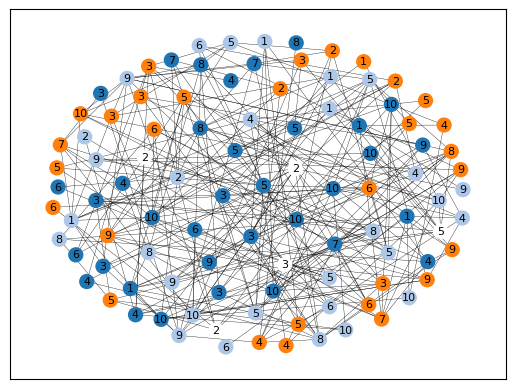

.. parsed-literal::

    Uncolored nodes have weights [2, 2, 2, 3, 5] giving a total cost = 14
    

In a similar fashion, we may prefer a solution in which all nodes are
assigned to colors but are willing to allow some clashes in a solution
(a clash occurs when the endpoints of an edge have the same color). The
aim is to now :math:`k`-color all nodes while minimizing the number of
clashes. Again, we might also choose to add positive weights to the
edges, in which case we will seek to minimize the sum of the weights of
the clashing edges.

The following example creates a small edge-weighted graph and then
produces a node 2-coloring using the routine
``gcol.min_cost_k_coloring()``. Six of the edges are causing a clash,
giving a total weight of 12.

.. code:: ipython3

    G = nx.dodecahedral_graph()
    for u, v in G.edges():
        G.add_edge(u, v, edgeweight=random.randint(1,5))
    
    c = gcol.min_cost_k_coloring(G, 2, weight="edgeweight", weights_at="edges", it_limit=1000)
    pos = nx.spring_layout(G, seed=1)
    nx.draw_networkx(G, pos=pos, node_color=gcol.get_node_colors(G, c))
    labels = nx.get_edge_attributes(G,'edgeweight')
    nx.draw_networkx_edge_labels(G, pos=pos, edge_labels=labels)
    plt.show()
    
    C = list( (u,v) for (u, v) in G.edges() if c[u]==c[v])
    print("The following edges are causing clashes", C, "giving a total cost of", sum(G[u][v]["edgeweight"] for (u, v) in C))

.. parsed-literal::

    The following edges are causing clashes [(0, 10), (3, 19), (4, 5), (6, 7), (11, 12), (13, 14)] giving a total cost of 11
    

Kempe Chains
------------

Given a node coloring of a graph, a `Kempe
chain <https://en.wikipedia.org/wiki/Kempe_chain>`__ is a connected set
of nodes that alternate in color. Equivalently, it is a maximal
connected subgraph that contains nodes of at most two colors.
Interchanging the colors of the nodes in a Kempe chain creates a new
coloring that uses the same number of colors, or one less color.

The following example takes a coloring ``c`` of a graph ``G`` and
determines a Kempe using node 18 (which is yellow) and color 1 (green).
The resultant Kempe chain is therefore the connected component of yellow
and green nodes that contains node 18. The nodes in this chain are
stored in the set ``K``. A Kempe chain interchange is then performed,
which swaps the colors of the nodes in ``K``, leading to the second
solution below.

.. code:: ipython3

    G = nx.dodecahedral_graph()
    c = gcol.node_k_coloring(G, 4)
    nx.draw_networkx(G, 
                     pos=nx.spring_layout(G, seed=1), 
                     node_color=gcol.get_node_colors(G,
                                                     c, 
                                                     palette=gcol.colorful))
    plt.show()
    
    K = gcol.kempe_chain(G, c, 18, 1)
    print("Kempe Chain built from node-18 and color 1 =", K)
    
    #do a Kempe chain interchange
    col1 = c[18]
    col2 = 1
    for v in K:
        if c[v] == col1:
            c[v] = col2
        else:
            c[v] = col1
    
    print("Interchanging the colors of these nodes gives:")
    nx.draw_networkx(G, 
                     pos=nx.spring_layout(G, seed=1), 
                     node_color=gcol.get_node_colors(G,
                                                     c,
                                                     palette=gcol.colorful))
    plt.show()

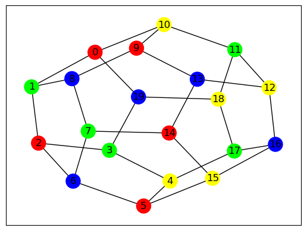

.. parsed-literal::

    Kempe Chain built from node-18 and color 1 = {3, 4, 10, 11, 12, 17, 18}
    Interchanging the colors of these nodes gives:
    

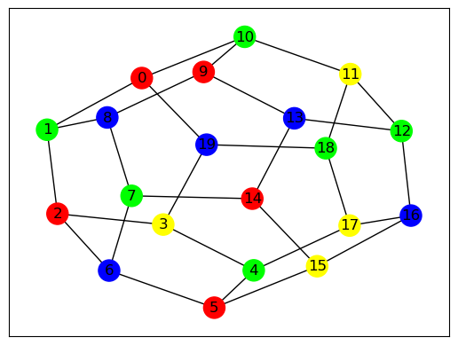

Independent Sets, Cliques and Coverings
---------------------------------------

In this final section we show how the algorithms of the ``gcol`` library
can be used to find (possibly approximate) solutions to the following
three NP-hard optimization problems.

- The *maximum independent set problem* involves determining the largest
  subset of nodes in a graph :math:`G` such that none of the nodes in
  this set are neighboring. The size of the largest independent set in
  :math:`G` is known as the *independence number*, denoted by
  :math:`\alpha(G)`.
- The *minimum node cover problem* involves determining the smallest
  subset of nodes in :math:`G` such that every edge in the graph has at
  least one endpoint from this set.
- The *maximum clique problem* involves determining the largest subset
  of nodes in :math:`G` such that every pair of nodes in this set is
  adjacent. The size of the largest clique in a graph :math:`G` is known
  as the *clique number*, denoted by :math:`\omega(G)`.

We can also define weights on the nodes, if desired. If these cases the
aims are to now maximize (or minimize) the sum of the weights of the
selected nodes.

The following example demonstrates how a large independent set of nodes
can be determined in the Les Miserables graph using the
``gcol.max_independent_set()`` method.

.. code:: ipython3

    G = nx.les_miserables_graph()
    S = gcol.max_independent_set(G, it_limit=10000)
    print("In Les Miserables, there is a subset of", len(S), "characters who never meet.")
    
    nx.draw_networkx(G, 
                     nx.spring_layout(G, seed=1), 
                     node_color=gcol.get_set_colors(G, S), 
                     node_size=100, 
                     font_size=8, 
                     width=0.25)
    plt.show()

.. parsed-literal::

    In Les Miserables, there is a subset of 35 characters who never meet.
    

In the above, the members of the independent set, whose size we have
tried to maximize, are shown in yellow. The set of grey nodes, whose
size has been minimized, gives us a node covering. Hence, we have
determined solutions to both problems.

Large cliques can also be found by using the
``gcol.max_independent_set()`` routine on the graph’s complement. A
demonstration of this is shown below.

.. code:: ipython3

    S = gcol.max_independent_set(nx.complement(G), it_limit=10000)
    print("In the set of", len(G), "Les Miserables characters, there's a subset of", len(S), "characters who form a clique. These are", S)
    nx.draw_networkx(G, 
                     nx.spring_layout(G, seed=1), 
                     node_color=gcol.get_set_colors(G, S), 
                     node_size=100, 
                     font_size=8, 
                     width=0.25)
    plt.show()

.. parsed-literal::

    In the set of 77 Les Miserables characters, there's a subset of 10 characters who form a clique. These are ['Combeferre', 'Feuilly', 'Mabeuf', 'Bahorel', 'Joly', 'Courfeyrac', 'Bossuet', 'Enjolras', 'Marius', 'Gavroche']
    

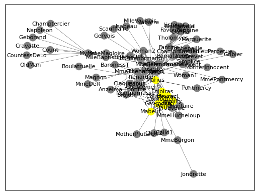

