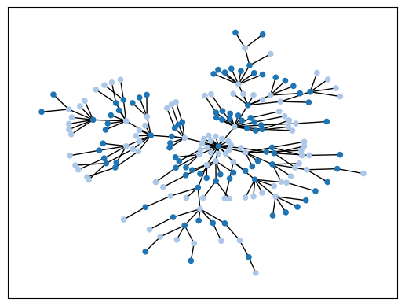
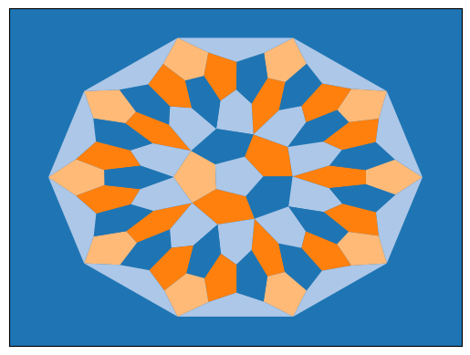
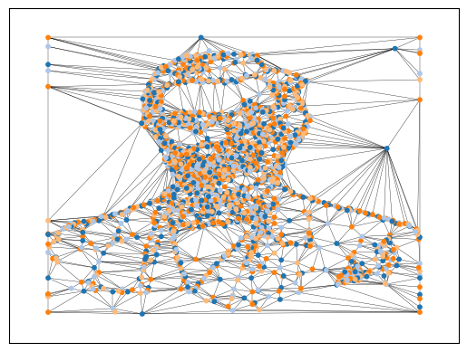

Gallery
=======

This chapter contains visualizations generated using the ``gcol``
library in conjunction with ``networkx``. Each example is accompanied by
the code used to generate it. We start by importing the necessary
libraries.

.. code:: ipython3

    import networkx as nx
    import matplotlib.pyplot as plt
    import gcol

Complete Graphs
---------------

A `complete graph <https://en.wikipedia.org/wiki/Complete_graph>`__ with
:math:`n` nodes has a chromatic number of :math:`n`. The following
example demonstrates this simple result using complete graphs of up to
seven nodes. The option ``nx.kamada_kawai_layout()`` is used to position
the nodes in a pleasing manner.

.. code:: ipython3

    def make_complete(n, s):
        H = nx.Graph()
        for i in range(n-1):
            for j in range(i+1, n):
                H.add_edge(s+i, s+j)
        return H
    
    G = nx.Graph()
    for n in range(2, 8):
        s = n*(n-1)//2
        H = make_complete(n, s)
        G = nx.union(G, H)
    c = gcol.node_coloring(G)
    nx.draw_networkx(
        G,
        pos=nx.kamada_kawai_layout(G),
        node_color=gcol.get_node_colors(G, c),
        with_labels=False,
        node_size=50
    )
    plt.show()

Cycle Graphs
------------

The following example considers `cycle
graphs <https://en.wikipedia.org/wiki/Cycle_graph>`__ with
:math:`n\geq 3` nodes. When :math:`n` is even, cycle graphs are
`bipartite <https://en.wikipedia.org/wiki/Bipartite_graph>`__ and
therefore have a chromatic number of two; otherwise, the chromatic
number is three. The following demonstrates this result in a similar
manner to the previous example.

.. code:: ipython3

    def make_cycle(n, s):
        H  = nx.Graph()
        for i in range(n-1):
            H.add_edge(s+i, s+i+1)
        H.add_edge(s+n-1,s)        
        return H
    
    G = nx.Graph()
    for n in range(3, 15):
        s = n*(n-1)//2
        H = make_cycle(n, s)
        G = nx.union(G, H)
    c = gcol.node_coloring(G)
    nx.draw_networkx(
        G, 
        pos=nx.spring_layout(G, seed=3), 
        node_color=gcol.get_node_colors(G, c),
        with_labels=False, 
        node_size=20
    )
    plt.show()

Wheel Graphs
------------

The next example considers `wheel
graphs <https://en.wikipedia.org/wiki/Wheel_graph>`__ with
:math:`n\geq 4` nodes. Cases with odd numbers of nodes have a chromatic
number of three; otherwise, the chromatic number is four. The following
demonstrates this.

.. code:: ipython3

    def make_wheel(n, s):
        H  = make_cycle(n-1, s)
        for i in range(n-1):
            H.add_edge(s+n-1, s+i)
        return H
    
    G = nx.Graph()
    for n in range(4, 10):
        s = n*(n-1)//2
        H = make_wheel(n, s)
        G = nx.union(G, H)
    c = gcol.node_coloring(G)
    nx.draw_networkx(
        G, 
        pos=nx.spring_layout(G, seed=3),
        node_color=gcol.get_node_colors(G, c), 
        with_labels=False, 
        node_size=20
    )
    plt.show()

.. image:: output_7_0.png

Trees
-----

Trees are connected graphs that contain no cycles. Consequently, they
are bipartite and have a chromatic number of two. The following code
generates a tree using the NetworkX method
``nx.barabasi_albert_graph()``. A node two-coloring of this tree is then
generated.

.. code:: ipython3

    G = nx.barabasi_albert_graph(200, 1)
    c = gcol.node_coloring(G)
    nx.draw_networkx(
        G, 
        pos=nx.kamada_kawai_layout(G), 
        node_color=gcol.get_node_colors(G, c), 
        with_labels=False, 
        node_size=20
    )
    plt.show()

Planar Graphs
-------------

The following code shows visualizations of a selection of planar graphs
from the `House of Graphs <https://houseofgraphs.org/>`__ website. The
names of the files used below refer to the graphs’ ID numbers on the
website. The files can also be found
`here <https://github.com/Rhyd-Lewis/GCol/blob/main/docs/gallery>`__.
For each graph, we show a node coloring and face coloring.

The first two graphs considered below are
`Eulerian <https://en.wikipedia.org/wiki/Eulerian_path>`__.
Consequently, their face chromatic numbers are two, as illustrated.

.. code:: ipython3

    def graphFromFile(filename):
        G = nx.Graph()
        with open(filename, 'r') as f:
            f.readline()
            n = int(f.readline())
            for i in range(n):
                L = f.readline().split(" ")
                G.add_node(i, pos=(float(L[0]),float(L[1])))
                for j in range(2, len(L)):
                    G.add_edge(i, int(L[j]))
        return G
    
    files = ['HoG-51392.txt', 
             'HoG-1317.txt',
             'HoG-1347.txt',
             'HoG-1122.txt']
            
    for file in files:
        G = graphFromFile(file)
        pos = nx.get_node_attributes(G, "pos")
        c = gcol.node_coloring(G)
        print("Colors =", max(c.values()) + 1)
        nx.draw_networkx(
            G, 
            pos=pos, 
            node_color=gcol.get_node_colors(G, c), 
            with_labels=False, 
            width=0.5,
            node_size=20
        )
        plt.show()
        c = gcol.face_coloring(G, pos)
        print("Colors =", max(c.values()) + 1)
        gcol.draw_face_coloring(c, pos, external=True)
        nx.draw_networkx(
            G,
            pos=pos,
            node_color='k',
            node_size=0,
            width=0,
            with_labels=False
        )
        plt.show()

.. parsed-literal::

    Colors = 3
    

.. image:: output_11_1.png

.. parsed-literal::

    Colors = 2
    

.. image:: output_11_3.png

.. parsed-literal::

    Colors = 4
    

.. image:: output_11_5.png

.. parsed-literal::

    Colors = 2
    

.. image:: output_11_7.png

.. parsed-literal::

    Colors = 4
    

.. parsed-literal::

    Colors = 4
    

.. image:: output_11_11.png

.. parsed-literal::

    Colors = 2
    

.. image:: output_11_13.png

.. parsed-literal::

    Colors = 3
    

The following code contains a function for randomly generating a planar
graph. Specifically, it randomly places :math:`n` nodes into the unit
square and then forms a `Delaunay
triangulation <https://en.wikipedia.org/wiki/Delaunay_triangulation>`__
among these. In the images below, planar graphs with
:math:`n\in\{100,250,500,1000\}` nodes are generated in turn, and their
faces are then colored.

.. code:: ipython3

    def make_planar_graph(n, seed=None):
        # Function for making a dense planar graph by placing nodes randomly
        # into the unit square, including corners
        assert n >= 4, "n parameter must be at least 4"
        import random
        from scipy.spatial import Delaunay
        random.seed(seed)
        P = [(0,0), (1,0), (0,1), (1, 1)]
        for i in range(4, n):
            P.append((random.uniform(0.05,0.95), random.uniform(0.05,0.95)))
        T = Delaunay(P).simplices.copy()
        G = nx.Graph()
        for v in range(n):
            G.add_node(v, pos=(P[v][0], P[v][1]))
        for x, y, z in T:
            G.add_edges_from([(x, y), (x, z), (y, z)])
        return G
    
    for n in [100, 250, 500, 1000]:
        G = make_planar_graph(n, seed=1)
        pos = nx.get_node_attributes(G, "pos")
        c = gcol.face_coloring(G, pos)
        gcol.draw_face_coloring(c, pos, external=True)
        print("Number of nodes  =", n)
        print("Number of edges  =", G.number_of_edges())
        print("Number of faces  =", 2- n + G.number_of_edges())
        print("Number of colors =", max(c.values()) + 1)
        nx.draw_networkx(
            G, 
            pos=pos, 
            with_labels=False, 
            node_size=2, 
            node_color="black",
            width=0.5
        )
        plt.show()

.. parsed-literal::

    Number of nodes  = 100
    Number of edges  = 293
    Number of faces  = 195
    Number of colors = 3
    

.. image:: output_13_1.png

.. parsed-literal::

    Number of nodes  = 250
    Number of edges  = 743
    Number of faces  = 495
    Number of colors = 3
    

.. image:: output_13_3.png

.. parsed-literal::

    Number of nodes  = 500
    Number of edges  = 1493
    Number of faces  = 995
    Number of colors = 3
    

.. parsed-literal::

    Number of nodes  = 1000
    Number of edges  = 2993
    Number of faces  = 1995
    Number of colors = 3
    

Interval Graphs
---------------

An `interval graph <https://en.wikipedia.org/wiki/Interval_graph>`__ is
a graph that represents the intersections of intervals on the real line.
Formally, each node :math:`v_i` corresponds to an interval
:math:`[a_i, b_i]` (where :math:`a_i,b_i\in\mathbb{R}`), and two nodes
are connected by an edge if and only if their corresponding intervals
overlap. Unlike general graphs, interval graphs can be optimally colored
in polynomial time. This is done by simply sorting the intervals by
their left endpoints and then using the corresponding node ordering with
the greedy coloring algorithm.

The following code provides an example. Here, a sorted list ``I`` of
intervals is first generated. These are then used to produce the
interval graph ``G`` which is then optimally colored using the
``greedy_color()`` method. In the final figure, the corresponding
intervals are shown. As required, overlapping intervals always have
different colors and the minimum number of colors (six) is being used.

.. code:: ipython3

    import random
    import itertools
    
    def greedy_color(G, L):
        # Greedily color the nodes in the order they appear in L
        c = {}
        for u in L:
            adjcols = {c[v] for v in G[u] if v in c}
            for j in itertools.count():
                if j not in adjcols:
                    break
            c[u] = j
        return c
    
    # Generate a list of random intervals sorted by starting value
    random.seed(1)
    n, I = 30, []
    for i in range(n):
        x = random.uniform(0.2, 0.8)
        a, b = sorted([x, x + random.uniform(-0.2, 0.2)])
        I.append((round(a, 3), round(b, 3)))
    I.sort(key=lambda x: x[0])
    print("The generated intervals are as follows:", I)
    
    print("This gives the following interval graph and coloring:")
    G = nx.Graph()
    for i in range(n):
        G.add_node(i)
    for i in range(n-1):
        for j in range(i+1, n):
            if max(I[i][0], I[j][0]) < min(I[i][1], I[j][1]):
                G.add_edge(i, j)
    c = greedy_color(G, [i for i in range(n)])
    nx.draw_networkx(
        G,
        pos=nx.circular_layout(G),
        width=0.5,
        node_color=gcol.get_node_colors(G, c, gcol.tableau)
    )
    plt.show()
    
    print("Here is the corresponding interval coloring:")
    for i in range(n):
        plt.hlines(y=i, xmin=I[i][0], xmax=I[i][1], colors=gcol.tableau[c[i]], linewidths=5)
    plt.xlabel("Interval range")
    plt.ylabel("Interval index")
    plt.show()
    print("Number of colors =", max(c.values()) + 1)

.. parsed-literal::

    The generated intervals are as follows: [(0.068, 0.256), (0.106, 0.217), (0.118, 0.221), (0.182, 0.374), (0.206, 0.273), (0.215, 0.232), (0.232, 0.34), (0.281, 0.42), (0.299, 0.33), (0.315, 0.331), (0.337, 0.515), (0.382, 0.417), (0.458, 0.657), (0.46, 0.585), (0.461, 0.463), (0.467, 0.556), (0.477, 0.497), (0.503, 0.539), (0.553, 0.741), (0.56, 0.658), (0.591, 0.706), (0.633, 0.717), (0.644, 0.678), (0.675, 0.701), (0.698, 0.766), (0.703, 0.725), (0.716, 0.763), (0.729, 0.868), (0.731, 0.762), (0.796, 0.94)]
    This gives the following interval graph and coloring:
    

.. parsed-literal::

    Here is the corresponding interval coloring:
    

.. image:: output_15_3.png

.. parsed-literal::

    Number of colors = 6
    

Triangulations of Images
------------------------

The next two examples consider Delaunay triangulations generated from
images. These triangulations were generated using the tool at `this
website <https://snorpey.github.io/triangulation/>`__ and correspond to
planar embeddings. The first image,
`Lincoln.txt <https://github.com/Rhyd-Lewis/GCol/blob/main/docs/gallery/Lincoln.txt>`__
is a portrait of `Abraham
Lincoln <https://en.wikipedia.org/wiki/Abraham_Lincoln>`__; the second,
`flag.txt <https://github.com/Rhyd-Lewis/GCol/blob/main/docs/gallery/flag.txt>`__,
is a picture of the `flag of
Wales <https://en.wikipedia.org/wiki/Flag_of_Wales>`__.

.. code:: ipython3

    files = ['Lincoln.txt', 'flag.txt']
            
    for file in files:
        G = graphFromFile(file)
        pos = nx.get_node_attributes(G, "pos")
        c = gcol.node_coloring(G, opt_alg=3, it_limit=100000)
        print("Colors =", max(c.values()) + 1)
        nx.draw_networkx(
            G, 
            pos=pos, 
            node_color=gcol.get_node_colors(G, c), 
            with_labels=False, 
            width=0.25,
            node_size=10
        )
        plt.show()
        
        c = gcol.face_coloring(G, pos, opt_alg=3, it_limit=100000)
        print("Colors =", max(c.values()) + 1)
        gcol.draw_face_coloring(c, pos, external=True)
        nx.draw_networkx(
            G,
            pos=pos,
            node_color='k',
            node_size=0,
            width=0,
            with_labels=False
        )
        plt.show()

.. parsed-literal::

    Colors = 4
    

.. image:: output_17_1.png

.. parsed-literal::

    Colors = 3
    

.. parsed-literal::

    Colors = 4
    

.. image:: output_17_5.png

.. parsed-literal::

    Colors = 3
    

.. image:: output_17_7.png

Coloring Street Maps
--------------------

The following images show a node coloring and edge coloring of the
street map of `Cardiff,
Wales <https://en.wikipedia.org/wiki/Cardiff>`__. In these graphs, edges
correspond to street segments, and nodes correspond to intersections and
dead ends. The file used for these images,
`cardiffstreets.txt <https://github.com/Rhyd-Lewis/GCol/blob/main/docs/gallery/cardiffstreets.txt>`__,
was generated using the
`osmnx <https://osmnx.readthedocs.io/en/stable/>`__ library. An edge
coloring of a street map is useful in that any path in the graph can be
described by just two things: the starting node, and a unique sequence
of colors representing each successive edge along the path.

.. code:: ipython3

    G = graphFromFile('cardiffstreets.txt')
    pos = nx.get_node_attributes(G, "pos")
    c = gcol.node_coloring(G)
    print("Colors =", max(c.values()) + 1)
    nx.draw_networkx(
        G, 
        pos=pos, 
        node_color=gcol.get_node_colors(G, c), 
        with_labels=False, 
        width=0.5,
        node_size=10
    )
    plt.show()
    
    c = gcol.edge_coloring(G)
    print("Colors =", max(c.values()) + 1)
    nx.draw_networkx(
        G,
        pos=pos,
        edge_color=gcol.get_edge_colors(G, c),
        node_size=0,
        width=2,
        with_labels=False
    )
    plt.show()

.. parsed-literal::

    Colors = 3
    

.. image:: output_19_1.png

.. parsed-literal::

    Colors = 6
    

.. image:: output_19_3.png

Mondrian Art
------------

The following code generates a mock-up of Piet Mondrian’s *Composition
A* (1923). The planar embedding of this graph can be found
`here <https://github.com/Rhyd-Lewis/GCol/blob/main/docs/gallery/mondrian.txt>`__.

.. code:: ipython3

    G = graphFromFile('mondrian.txt')
    pos = nx.get_node_attributes(G, "pos")
    c = gcol.face_coloring(G, pos)
    for u in c:
        if c[u] == 1:
            c[u] = -1
    print("Colors =", max(c.values()) + 1)
    gcol.draw_face_coloring(c, pos, palette=gcol.colorful)
    nx.draw_networkx(
        G,
        pos=pos,
        node_size=0,
        width=2,
        with_labels=False
    )
    plt.show()

.. parsed-literal::

    Colors = 4
    

.. image:: output_21_1.png

An April Fool’s Joke
--------------------

In 1975, Martin Gardner published an April Fool’s article in *Scientific
American* entitled “Mathematical Games: Six Sensational Discoveries that
Somehow or Another have Escaped Public Attention”. One of the many
deliberately false claims made in the article was that the faces of the
following
`graph <https://github.com/Rhyd-Lewis/GCol/blob/main/docs/gallery/mcgregorgraph.txt>`__
could not be four-colored, therefore disproving the `four color
theorem <https://en.wikipedia.org/wiki/Four_color_theorem>`__.

Of course, like all planar embeddings, a four coloring *is* possible in
this case, as we now demonstrate.

.. code:: ipython3

    G = graphFromFile('mcgregorgraph.txt')
    pos = nx.get_node_attributes(G, "pos")
    c = gcol.face_coloring(G, pos, opt_alg=1)
    gcol.draw_face_coloring(
        c, pos, external=True, palette=gcol.colorful
    )
    print("Colors =", max(c.values()) + 1)
    nx.draw_networkx(
        G,
        pos=pos,
        node_size=0,
        width=1,
        with_labels=False
    )
    plt.show()

.. parsed-literal::

    Colors = 4
    

.. image:: output_23_1.png

