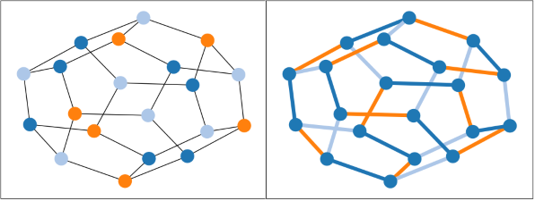

GCol: A Library for Graph Coloring
==================================

GCol is an open-source Python library for graph coloring that is built on top of the NetworkX package. It provides easy-to-use, high-performance algorithms for node coloring, edge coloring, face coloring, equitable coloring, weighted coloring, precoloring, list coloring, and maximum independent set identification. It also offers several tools for solution visualization. 

In general, graph coloring problems are NP-hard. This library therefore offers both exponential-time exact algorithms and polynomial-time heuristic algorithms.

.. toctree::
   :maxdepth: 5
   :numbered:
   :caption: Contents:

   info
   demo/Demo
   vis/Vis
   casestudy/CaseStudy
   performance/Performance
   gallery/Gallery
   modules

* :ref:`genindex`
* :ref:`modindex`
* :ref:`search`
