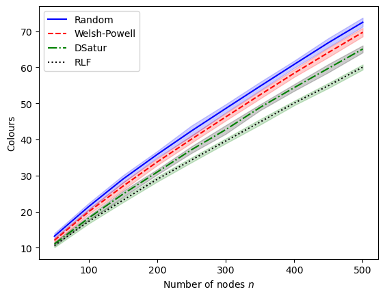
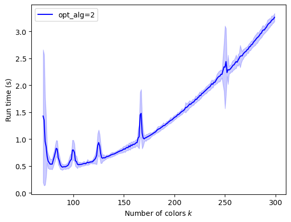

Performance Analysis
====================

In this chapter we analyze the behavior of the various node coloring
algorithms in the ``gcol`` library. Where appropriate, we also make
comparisons to similar algorithms from the ``networkx`` library.

Here, algorithms are evaluated by looking at solution quality and run
times. Details on algorithm complexity (in terms of big O notation) can
be found in ``gcol``\ ’s documentation. Here, all tests are conducted on
randomly generated
`Erdos-Renyi <https://en.wikipedia.org/wiki/Erdos-Renyi_model>`__
graphs, commonly denoted by :math:`G(n,p)`. These graphs are constructed
by taking :math:`n` nodes and adding an edge between each node pair at
random with probability :math:`p`. The expected number of edges in a
:math:`G(n,p)` graph is therefore :math:`\binom{n}{2}p`, while the
expected node degree is :math:`(n-1)p`.

For these tests, we use differing values for :math:`n` but keep
:math:`p` fixed at :math:`0.5`. This is due to a
`result <https://mathoverflow.net/questions/424327/selection-of-an-n-node-graph-at-random>`__
of `Nick Wormald <https://en.wikipedia.org/wiki/Nick_Wormald>`__, who
has established that for :math:`n \gtrapprox 30`, a set of randomly
constructed :math:`G(n, 0.5)` graphs can be considered equivalent to a
random sample from the population of *all* unlabeled :math:`n`-node
graphs. This allows us to make general statistical statements about
performance across the set of all :math:`n`-node graphs, although
different observations may well be made when executing these algorithms
on specifically chosen topologies, such as `scale-free
graphs <https://en.wikipedia.org/wiki/Scale-free_network>`__ and `planar
graphs <https://en.wikipedia.org/wiki/Planar_graph>`__. Examples of
these differences are discussed in this
`book <https://link.springer.com/book/10.1007/978-3-030-81054-2>`__,
where a wider set of trials is conducted.

In the code below, each trial involves generating a set of
:math:`G(n,0.5)` graphs using a range of values of :math:`n`. The
results of the algorithms are then written to a Pandas dataframe ``df``,
aggregated in a ``pivot`` table, and summarized in charts. Lines in the
charts give mean values, while the shaded areas indicate one standard
deviation on either side of these means. All results below were found by
executing the code on a 3.0 GHtz Windows 11 PC with 16 GB of RAM.

We start by importing the libraries we need.

.. code:: ipython3

    import pandas as pd
    import networkx as nx
    import gcol
    import matplotlib.pyplot as plt
    import time

Differing Node Coloring Strategies
----------------------------------

In our first experiment, we compare the different constructive
strategies available for node coloring in the ``gcol`` library (namely
``'random'``, ``'welsh_powell'``, ``'dsatur'``, and ``'rlf'``) using
:math:`G(n,0.5)` graphs with values of :math:`n` between :math:`50` and
:math:`500`. The results are shown in the charts below. Further details
on these algorithms can be found in ``gcol``\ ’s documentation.

.. code:: ipython3

    #Carry out the trials and put the results into a list
    results = []
    nVals = range(50,501,50)
    for n in nVals:
        for seed in range(50):
            G = nx.gnp_random_graph(n, 0.5, seed)
            for strategy in ["random", "welsh_powell", "dsatur", "rlf"]:
                start = time.time()
                c = gcol.node_coloring(G, strategy)
                results.append([n, seed, strategy, max(c.values()) + 1, time.time()-start])
                
    # Create a pandas dataframe from this list and make a pivot table
    df = pd.DataFrame(results, columns=["n", "seed", "strategy", "cols", "time"])
    pivot = df.pivot_table(columns='strategy', aggfunc=['mean','std'], values=['cols','time'], index='n')
    
    # Now use the pivot table to make a chart that compares mean solution quality
    mean1, SD1 = pivot[("mean","cols","random")], pivot[("std","cols","random")]
    mean2, SD2 = pivot[("mean","cols","welsh_powell")], pivot[("std","cols","welsh_powell")]
    mean3, SD3 = pivot[("mean","cols","dsatur")], pivot[("std","cols","dsatur")]
    mean4, SD4 = pivot[("mean","cols","rlf")], pivot[("std","cols","rlf")]
    plt.plot(nVals, mean1, linestyle='-', linewidth=1.5, color="b", label='Random')
    plt.fill_between(nVals, mean1-SD1, mean1+SD1, color='b', alpha=0.2)
    plt.plot(nVals, mean2, linestyle='--', linewidth=1.5, color="r", label='Welsh-Powell')
    plt.fill_between(nVals, mean2-SD2, mean2+SD2, color='r', alpha=0.2)
    plt.plot(nVals, mean3, linestyle='-.', linewidth=1.5, color="g", label='DSatur')
    plt.fill_between(nVals, mean3-SD3, mean3+SD3, color='k', alpha=0.2)
    plt.plot(nVals, mean4, linestyle=':', linewidth=1.5, color="black", label='RLF')
    plt.fill_between(nVals, mean4-SD4, mean4+SD4, color='g', alpha=0.2)
    plt.xlabel("Number of nodes $n$")
    plt.ylabel("Colours")
    plt.legend()
    plt.show()
    
    # and do the same for mean run times
    mean1, SD1 = pivot[("mean","time","random")], pivot[("std","time","random")]
    mean2, SD2 = pivot[("mean","time","welsh_powell")], pivot[("std","time","welsh_powell")]
    mean3, SD3 = pivot[("mean","time","dsatur")], pivot[("std","time","dsatur")]
    mean4, SD4 = pivot[("mean","time","rlf")], pivot[("std","time","rlf")]
    plt.plot(nVals, mean1, linestyle='-', linewidth=1.5, color="b", label='Random')
    plt.fill_between(nVals, mean1-SD1, mean1+SD1, color='b', alpha=0.2)
    plt.plot(nVals, mean2, linestyle='--', linewidth=1.5, color="r", label='Welsh-Powell')
    plt.fill_between(nVals, mean2-SD2, mean2+SD2, color='r', alpha=0.2)
    plt.plot(nVals, mean3, linestyle='-.', linewidth=1.5, color="g", label='DSatur')
    plt.fill_between(nVals, mean3-SD3, mean3+SD3, color='k', alpha=0.2)
    plt.plot(nVals, mean4, linestyle=':', linewidth=1.5, color="black", label='RLF')
    plt.fill_between(nVals, mean4-SD4, mean4+SD4, color='g', alpha=0.2)
    plt.xlabel("Number of nodes $n$")
    plt.ylabel("Run time (s)")
    plt.legend()
    plt.show()

The results above show that the ``random`` and ``welsh-powell``
strategies produce the poorest solutions overall (in terms of the number
of colors they use) while the RLF algorithm produces the best. This gap
also seems to widen for larger values of :math:`n`. On the other hand,
the RLF algorithm has less favorable run times, as shown in the second
chart. This is to be expected because the RLF algorithm has a higher
complexity than the other options. A good compromise seems to be struck
by the ``dsatur`` strategy, which features comparatively good solution
quality and run times.

Optimization Output
-------------------

The following code demonstrates how the ``verbose`` parameter can be
used to produce run-time output for the various optimization algorithms.
This allows us to monitor algorithm performance during execution.

.. code:: ipython3

    G = nx.gnp_random_graph(50, 0.5)
    c = gcol.node_coloring(G, strategy="welsh_powell", opt_alg=1, verbose=1)

.. parsed-literal::

    Running backtracking algorithm:
        Found solution with 13 colors. Total backtracking iterations = 0
        Found solution with 12 colors. Total backtracking iterations = 52
        Found solution with 11 colors. Total backtracking iterations = 1293
        Found solution with 10 colors. Total backtracking iterations = 28972977
    Ending backtracking at iteration 34324898 - optimal solution achieved.
    

In the above example, the initial solution has used 13 colors. The
backtracking algorithm (``opt_alg=1``) has been used to reduce the
number of colors, eventually finding an optimal solution. We can do
similar things with the other optimization algorithms while controlling
their number of iterations:

.. code:: ipython3

    G = nx.gnp_random_graph(50, 0.5)
    c = gcol.node_coloring(G, strategy="welsh_powell", opt_alg=2, it_limit=10000, verbose=1)

.. parsed-literal::

    Running local search algorithm:
        Found solution with 12 colors. Total local search iterations = 0 / 10000
        Found solution with 11 colors. Total local search iterations = 12 / 10000
        Found solution with 10 colors. Total local search iterations = 241 / 10000
    Ending local search. Iteration limit of 10000 has been reached.
    

In some cases, we can also increase the amount of output by using a
larger value with ``verbose``:

.. code:: ipython3

    G = nx.gnp_random_graph(50, 0.5)
    c = gcol.node_coloring(G, strategy="welsh_powell", opt_alg=3, it_limit=10000, verbose=2)

.. parsed-literal::

    Running local search algorithm:
        Found solution with 12 colors. Total local search iterations = 0 / 10000
        Running PartialCol algorithm using 11 colors
            Solution with 11 colors and cost 5 found by PartialCol at iteration 0
            Solution with 11 colors and cost 4 found by PartialCol at iteration 1
            Solution with 11 colors and cost 3 found by PartialCol at iteration 2
            Solution with 11 colors and cost 2 found by PartialCol at iteration 3
            Solution with 11 colors and cost 1 found by PartialCol at iteration 4
            Solution with 11 colors and cost 0 found by PartialCol at iteration 6
        Ending PartialCol
        Found solution with 11 colors. Total local search iterations = 6 / 10000
        Running PartialCol algorithm using 10 colors
            Solution with 10 colors and cost 5 found by PartialCol at iteration 0
            Solution with 10 colors and cost 4 found by PartialCol at iteration 1
            Solution with 10 colors and cost 3 found by PartialCol at iteration 22
            Solution with 10 colors and cost 2 found by PartialCol at iteration 32
            Solution with 10 colors and cost 1 found by PartialCol at iteration 155
            Solution with 10 colors and cost 0 found by PartialCol at iteration 896
        Ending PartialCol
        Found solution with 10 colors. Total local search iterations = 902 / 10000
        Running PartialCol algorithm using 9 colors
            Solution with 9 colors and cost 5 found by PartialCol at iteration 0
            Solution with 9 colors and cost 4 found by PartialCol at iteration 6
            Solution with 9 colors and cost 3 found by PartialCol at iteration 46
            Solution with 9 colors and cost 2 found by PartialCol at iteration 1498
        Ending PartialCol
    Ending local search. Iteration limit of 10000 has been reached.
    

Comparison to NetworkX
----------------------

The next set of experiments compares the performance of ``gcol``\ ’s
local search routines and NetworkX’s `interchange coloring
routine <https://networkx.org/documentation/stable/reference/algorithms/generated/networkx.algorithms.coloring.greedy_color.html>`__.
As a benchmark, we also include ``gcol``\ ’s ``dsatur`` option from
earlier, which is also used to produce the initial solutions for the
local search algorithms. For comparative purposes, two of ``gcol``\ ’s
local search algorithms (``opt_alg=2`` and ``opt_alg=3``) are used here,
and we impose a fixed iteration limit of :math:`n`. The results are
collected and displayed in the same manner as the previous example.

.. code:: ipython3

    #Carry out the trials and put the results into a list
    results = []
    nVals = range(50,601,50)
    for n in nVals:
        for seed in range(50):
            G = nx.gnp_random_graph(n, 0.5, seed)
            start = time.time()
            c = nx.greedy_color(G, "largest_first", interchange=True)
            results.append([n, seed, "networkx", max(c.values()) + 1, time.time()-start])
            start = time.time()
            c = gcol.node_coloring(G)
            results.append([n, seed, "dsatur", max(c.values()) + 1, time.time()-start])
            start = time.time()
            c = gcol.node_coloring(G, opt_alg=2, it_limit=len(G))
            results.append([n, seed, "opt_alg=2", max(c.values()) + 1, time.time()-start])
            start = time.time()
            c = gcol.node_coloring(G, opt_alg=3, it_limit=len(G))
            results.append([n, seed, "opt_alg=3", max(c.values()) + 1, time.time()-start])
                
    # Create a pandas dataframe from this list and make a pivot table
    df = pd.DataFrame(results, columns=["n", "seed", "alg", "cols", "time"])
    pivot = df.pivot_table(columns='alg', aggfunc=['mean','std'], values=['cols','time'], index='n')
    
    # Use the pivot table to make charts as before
    mean1, SD1 = pivot[("mean","cols","networkx")], pivot[("std","cols","networkx")]
    mean2, SD2 = pivot[("mean","cols","dsatur")], pivot[("std","cols","dsatur")]
    mean3, SD3 = pivot[("mean","cols","opt_alg=2")], pivot[("std","cols","opt_alg=2")]
    mean4, SD4 = pivot[("mean","cols","opt_alg=3")], pivot[("std","cols","opt_alg=3")]
    plt.plot(nVals, mean1, linestyle='-', linewidth=1.5, color="b", label='NetworkX')
    plt.fill_between(nVals, mean1-SD1, mean1+SD1, color='b', alpha=0.2)
    plt.plot(nVals, mean2, linestyle='--', linewidth=1.5, color="r", label='DSatur')
    plt.fill_between(nVals, mean2-SD2, mean2+SD2, color='r', alpha=0.2)
    plt.plot(nVals, mean3, linestyle='-.', linewidth=1.5, color="g", label='opt_alg=2')
    plt.fill_between(nVals, mean3-SD3, mean3+SD3, color='k', alpha=0.2)
    plt.plot(nVals, mean4, linestyle=':', linewidth=1.5, color="black", label='opt_alg=3')
    plt.fill_between(nVals, mean4-SD4, mean4+SD4, color='g', alpha=0.2)
    plt.xlabel("Number of nodes $n$")
    plt.ylabel("Colours")
    plt.legend()
    plt.show()
    
    mean1, SD1 = pivot[("mean","time","networkx")], pivot[("std","time","networkx")]
    mean2, SD2 = pivot[("mean","time","dsatur")], pivot[("std","time","dsatur")]
    mean3, SD3 = pivot[("mean","time","opt_alg=2")], pivot[("std","time","opt_alg=2")]
    mean4, SD4 = pivot[("mean","time","opt_alg=3")], pivot[("std","time","opt_alg=3")]
    plt.plot(nVals, mean1, linestyle='-', linewidth=1.5, color="b", label='NetworkX')
    plt.fill_between(nVals, mean1-SD1, mean1+SD1, color='b', alpha=0.2)
    plt.plot(nVals, mean2, linestyle='--', linewidth=1.5, color="r", label='DSatur')
    plt.fill_between(nVals, mean2-SD2, mean2+SD2, color='r', alpha=0.2)
    plt.plot(nVals, mean3, linestyle='-.', linewidth=1.5, color="g", label='opt_alg=2')
    plt.fill_between(nVals, mean3-SD3, mean3+SD3, color='k', alpha=0.2)
    plt.plot(nVals, mean4, linestyle=':', linewidth=1.5, color="black", label='opt_alg=3')
    plt.fill_between(nVals, mean4-SD4, mean4+SD4, color='g', alpha=0.2)
    plt.xlabel("Number of nodes $n$")
    plt.ylabel("Run time (s)")
    plt.legend()
    plt.show()

It is clear from the above results that the local search algorithms make
significant improvements to the solutions provided by the ``dsatur``
strategy, albeit with additional time requirements. The solutions and
run times of these local search algorithms are also superior to
NetworkX’s node coloring routines. Further improvements in solution
quality can usually be found by increasing the iteration limit of the
local search algorithms, as demonstrated below.

Exact Algorithm Performance
---------------------------

In addition to local search, the ``gcol`` library features an exact,
exponential-time algorithm for node coloring, based on backtracking.
This algorithm is invoked by setting ``opt_alg=1`` (the parameter
``it_limit`` is redundant here). At the start of this algorithm’s
execution, a large clique :math:`C` is identified in :math:`G` using the
NetworkX function ``nx.max_clique()``. The nodes of :math:`C` are then
permanently assigned to different colors. The main backtracking
algorithm is then executed and only halts only when a solution using
:math:`C` colors has been identified, or when the algorithm has
backtracked to the root of the search tree. In both cases the returned
solution will be optimal (that is, it will be using the minimum number
of colors).

The following code evaluates the performance of this algorithm on
:math:`G(n,0.5)` graphs for a range of :math:`n`-values.

.. code:: ipython3

    results = []
    nVals = range(2,61,2)
    for n in nVals:
        for seed in range(25):
            G = nx.gnp_random_graph(n, 0.5, seed)
            start = time.time()
            c = gcol.node_coloring(G, opt_alg=1)
            results.append([n, seed, "opt_alg=1", max(c.values()) + 1, time.time()-start])
            
    # Create a pandas dataframe from this list and make a pivot 
    df = pd.DataFrame(results, columns=["n", "seed", "alg", "cols", "time"])
    pivot = df.pivot_table(columns='alg', aggfunc=['mean','std'], values=['cols','time'], index='n')
    
    # Use the pivot table above to make the charts as before
    mean1, SD1 = pivot[("mean","cols","opt_alg=1")], pivot[("std","cols","opt_alg=1")]
    plt.plot(nVals, mean1, linestyle='-', linewidth=1.5, color="b", label='opt_alg=1')
    plt.fill_between(nVals, mean1-SD1, mean1+SD1, color='b', alpha=0.2)
    plt.xlabel("Number of nodes $n$")
    plt.ylabel("Colours")
    plt.legend()
    plt.show()
    
    mean1, SD1 = pivot[("mean","time","opt_alg=1")], pivot[("std","time","opt_alg=1")]
    plt.plot(nVals, mean1, linestyle='-', linewidth=1.5, color="b", label='opt_alg=1')
    plt.fill_between(nVals, mean1-SD1, mean1+SD1, color='b', alpha=0.2)
    plt.xlabel("Number of nodes $n$")
    plt.ylim((0, 120))
    plt.ylabel("Run time (s)")
    plt.legend()
    plt.show()

.. image:: output_13_0.png

The first chart above shows the chromatic numbers from a sample of
:math:`G(n,0.5)` graphs for an increasing number of nodes :math:`n`. It
can be seen that the chromatic number rises in a close-to-linear fashion
in relation to :math:`n`. The second figure demonstrates the
disadvantages of using this exponential-time algorithm: once :math:`n`
is increased beyond a moderately small value (approximately 55 here),
run times become unpredictable and often very long. Note, however, that
the specific :math:`n`-values that give these long run times can vary
considerably depending on the topology of the graph. For example, planar
graphs and scale-free graphs with several hundred nodes are often solved
very quickly by the backtracking algorithm. These sorts of results will
usually need to be confirmed empirically.

Local Search Comparison
-----------------------

In addition to the above exact algorithm, the ``gcol`` library features
a choice of four high-performance optimization heuristics, based on
local search (more specifically, tabu search).

- ``opt_alg=2`` makes use of the TabuCol algorithm
- ``opt_alg=3`` makes use of the PartialCol algorithm
- ``opt_alg=4`` uses a hybrid evolutionary algorithm (HEA) in
  conjunction with TabuCol
- ``opt_alg=5`` uses a hybrid evolutionary algorithm (HEA) in
  conjunction with PartialCol

These are among the best-known algorithms for graph coloring. Further
information on these can be found in the library’s
`documentation <https://gcol.readthedocs.io/en/latest/modules.html>`__
and in this
`book <https://link.springer.com/book/10.1007/978-3-030-81054-2>`__.
Executing these heuristics with higher iteration limits usually leads to
better solutions (that is, solutions using fewer colors). To illustrate,
the following code runs the four optimization algorithms with differing
iteration limits on a set of twenty :math:`G(500, 0.5)` graphs.

.. code:: ipython3

    results = []
    it_limits = [200, 2000, 20000, 200000, 2000000, 20000000]
    for seed in range(20):
        G = nx.gnp_random_graph(500, 0.5, seed)
        for opt_alg in [2, 3, 4, 5]:
            for it_limit in it_limits:
                start = time.time()
                c = gcol.node_colouring(G, opt_alg=opt_alg, it_limit=it_limit)
                results.append([seed, opt_alg, it_limit, max(c.values()) + 1, time.time()-start])
    
    # Create a pandas dataframe from this list and make a pivot table
    df = pd.DataFrame(results, columns=["seed", "opt_alg", "it_limit", "cols", "time"])
    pivot = df.pivot_table(columns='opt_alg', aggfunc=['mean','std'], values=['cols','time'], index='it_limit')
    
    # Use the pivot table to make charts as before
    mean1, SD1 = pivot[("mean","cols",2)], pivot[("std","cols",2)]
    mean2, SD2 = pivot[("mean","cols",3)], pivot[("std","cols",3)]
    mean3, SD3 = pivot[("mean","cols",4)], pivot[("std","cols",4)]
    mean4, SD4 = pivot[("mean","cols",5)], pivot[("std","cols",5)]
    plt.plot(it_limits, mean1, linestyle='-', linewidth=1.5, color="b", label='opt_alg=2')
    plt.fill_between(it_limits, mean1-SD1, mean1+SD1, color='b', alpha=0.2)
    plt.plot(it_limits, mean2, linestyle='--', linewidth=1.5, color="r", label='opt_alg=3')
    plt.fill_between(it_limits, mean2-SD2, mean2+SD2, color='r', alpha=0.2)
    plt.plot(it_limits, mean3, linestyle='-.', linewidth=1.5, color="g", label='opt_alg=4')
    plt.fill_between(it_limits, mean3-SD3, mean3+SD3, color='k', alpha=0.2)
    plt.plot(it_limits, mean4, linestyle=':', linewidth=1.5, color="black", label='opt_alg=5')
    plt.fill_between(it_limits, mean4-SD4, mean4+SD4, color='g', alpha=0.2)
    plt.xlabel("it_limit")
    plt.ylabel("Colours")
    plt.legend()
    plt.xscale('log')
    plt.show()
    
    mean1, SD1 = pivot[("mean","time",2)], pivot[("std","time",2)]
    mean2, SD2 = pivot[("mean","time",3)], pivot[("std","time",3)]
    mean3, SD3 = pivot[("mean","time",4)], pivot[("std","time",4)]
    mean4, SD4 = pivot[("mean","time",5)], pivot[("std","time",5)]
    plt.plot(it_limits, mean1, linestyle='-', linewidth=1.5, color="b", label='opt_alg=2')
    plt.fill_between(it_limits, mean1-SD1, mean1+SD1, color='b', alpha=0.2)
    plt.plot(it_limits, mean2, linestyle='--', linewidth=1.5, color="r", label='opt_alg=3')
    plt.fill_between(it_limits, mean2-SD2, mean2+SD2, color='r', alpha=0.2)
    plt.plot(it_limits, mean3, linestyle='-.', linewidth=1.5, color="g", label='opt_alg=4')
    plt.fill_between(it_limits, mean3-SD3, mean3+SD3, color='k', alpha=0.2)
    plt.plot(it_limits, mean4, linestyle=':', linewidth=1.5, color="black", label='opt_alg=5')
    plt.fill_between(it_limits, mean4-SD4, mean4+SD4, color='g', alpha=0.2)
    plt.xlabel("it_limit")
    plt.ylabel("Run time (s)")
    plt.legend()
    plt.xscale('log')
    plt.show()

Note that the charts above use log scales on their horizontal axes. The
first chart shows how using an increased iteration limit can result in
solutions that have fewer colors. For very high limits, the hybrid
evolutionary algorithms are clearly more favorable. The second chart
shows how the iteration limits affect run times with these graphs.

Equitable Coloring
------------------

In the (unweighted) equitable node-coloring problem, we are interested
in coloring the nodes with a user-defined number of colors :math:`k` so
that (a) adjacent nodes have different colors, and (b) the number of
nodes in each color is as equal as possible. The following trials run
the ``gcol.equitable_node_k_coloring()`` method on a sample of random
:math:`G(500,0.5)` graphs over a range of suitable :math:`k`-values. The
reported cost is simply the difference in size between the largest and
smallest color classes in a solution. Hence, if :math:`k` is a divisor
of :math:`n`, a cost of zero indicates an equitable :math:`k`-coloring,
else a cost of one indicates an equitable coloring.

.. code:: ipython3

    results = []
    n = 500
    kVals = range(70, 300, 1)
    for seed in range(50):
        G = nx.gnp_random_graph(n, 0.5, seed)
        for k in kVals:
            start = time.time()
            c = gcol.equitable_node_k_coloring(G, k, opt_alg=2, it_limit=len(G))
            P = gcol.partition(c)
            cost = max(len(j) for j in P) - min(len(j) for j in P)
            results.append([k, seed, "opt_alg=2", cost, time.time()-start])
    
    # Create a pandas dataframe from this list and make a pivot table
    df = pd.DataFrame(results, columns=["k", "seed", "alg", "cost", "time"])
    pivot = df.pivot_table(columns='alg', aggfunc=['mean','std'], values=['cost','time'], index='k')
    
    # Use the pivot table above to make charts as before
    mean1, SD1 = pivot[("mean","cost","opt_alg=2")], pivot[("std","cost","opt_alg=2")]
    plt.plot(kVals, mean1, linestyle='-', linewidth=1.5, color="b", label='opt_alg=2')
    plt.fill_between(kVals, mean1-SD1, mean1+SD1, color='b', alpha=0.2)
    plt.xlabel("Number of colors $k$")
    plt.ylabel("Cost")
    plt.legend()
    plt.show()
    
    mean1, SD1 = pivot[("mean","time","opt_alg=2")], pivot[("std","time","opt_alg=2")]
    plt.plot(kVals, mean1, linestyle='-', linewidth=1.5, color="b", label='opt_alg=2')
    plt.fill_between(kVals, mean1-SD1, mean1+SD1, color='b', alpha=0.2)
    plt.xlabel("Number of colors $k$")
    plt.ylabel("Run time (s)")
    plt.legend()
    plt.show()

.. image:: output_17_0.png

The first chart above demonstrates that the
``gcol.equitable_node_k_coloring()`` method consistently achieves
equitable node :math:`k`-colorings. The exceptions occur for low values
of :math:`k` (which are close to the chromatic number) and when
:math:`k` is a divisor of :math:`n`. In the former case, the low number
of available colors restricts the choice of appropriate colors for each
node, often leading to inequitable colorings. On the other hand, when
:math:`k` is a divisor of :math:`n`, the algorithm is seeking a solution
with a cost of zero, meaning that each color class must have *exactly*
the same number of nodes. If this cannot be achieved, then a cost of at
least two must be incurred.

The second chart above also indicates that runtimes of this routine
increase slightly when :math:`k` is a divisor of :math:`n`. Run times
also lengthen due to increases in :math:`k`. The latter is due to the
larger number of solutions that need to be evaluated in each iteration
of the local search algorithm used with this routine. More details on
this algorithm can be found in ``gcol``\ ’s documentation.

Finally, note that NetworkX
`features <https://networkx.org/documentation/stable/reference/algorithms/generated/networkx.algorithms.coloring.equitable_color.html>`__
an exact equitable node :math:`k`-coloring routine, but this can only be
used for values of :math:`k\geq \Delta(G)+1`, where :math:`\Delta(G)` is
the highest node degree in the graph. In the :math:`G(500,0.5)` graphs
considered here, the minimum valid value for :math:`k` is approximately
280.

Independent Set Comparison
--------------------------

Our final set or trials looks at the performance the
``gcol.max_independent_set()`` routine and compares it to the
`approximation
algorithm <https://networkx.org/documentation/stable/reference/algorithms/generated/networkx.algorithms.approximation.clique.maximum_independent_set.html>`__
included in NetworkX for the same problem. As before, we use an
iteration limit of :math:`n` for the former.

.. code:: ipython3

    #Carry out the trials and put the results into a list
    results = []
    nVals = range(50,501,50)
    for n in nVals:
        for seed in range(50):
            G = nx.gnp_random_graph(n, 0.5, seed)
            start = time.time()
            S = gcol.max_independent_set(G, it_limit=len(G))
            results.append([n, seed, "gcol", len(S), time.time()-start])
            start = time.time()
            S = nx.approximation.maximum_independent_set(G)
            results.append([n, seed, "networkx", len(S), time.time()-start])
            
    # Create a pandas dataframe from this list and make a pivot table
    df = pd.DataFrame(results, columns=["n", "seed", "alg", "size", "time"])
    pivot = df.pivot_table(columns='alg', aggfunc=['mean','std'], values=['size','time'], index='n')
    
    # Create the charts as before
    mean1, SD1 = pivot[("mean","size","networkx")], pivot[("std","size","networkx")]
    mean2, SD2 = pivot[("mean","size","gcol")], pivot[("std","size","gcol")]
    plt.plot(nVals, mean1, linestyle='-', linewidth=1.5, color="b", label='NetworkX')
    plt.fill_between(nVals, mean1-SD1, mean1+SD1, color='b', alpha=0.2)
    plt.plot(nVals, mean2, linestyle='--', linewidth=1.5, color="r", label='GCol')
    plt.fill_between(nVals, mean2-SD2, mean2+SD2, color='r', alpha=0.2)
    plt.xlabel("Number of nodes $n$")
    plt.ylabel("Independent Set Size")
    plt.legend()
    plt.show()
    
    mean1, SD1 = pivot[("mean","time","networkx")], pivot[("std","time","networkx")]
    mean2, SD2 = pivot[("mean","time","gcol")], pivot[("std","time","gcol")]
    plt.plot(nVals, mean1, linestyle='-', linewidth=1.5, color="b", label='NetworkX')
    plt.fill_between(nVals, mean1-SD1, mean1+SD1, color='b', alpha=0.2)
    plt.plot(nVals, mean2, linestyle='--', linewidth=1.5, color="r", label='GCol')
    plt.fill_between(nVals, mean2-SD2, mean2+SD2, color='r', alpha=0.2)
    plt.xlabel("Number of nodes $n$")
    plt.ylabel("Run time (s)")
    plt.legend()
    plt.show()        

The results above show quite clearly that the
``gcol.max_independent_set()`` routine produces better quality solutions
(larger independent sets) in less time. As before, further improvements
in solution quality (but longer run times) may also be found by
increasing the ``it_limit`` parameter.
