Node Placement and Color Palettes
=================================

In this chapter, we demonstrate ways in which graph coloring solutions
can be visualized using tools from the ``networkx`` and ``gcol``
libraries. Further information on the former can be found in its `online
documentation <https://networkx.org/documentation/stable/reference/index.html>`__.

Node Placement
--------------

Node placement is an important aspect of network visualization because
it shapes how structure and meaning are perceived. Good layouts can
reveal patterns such as communities and hierarchies, making
relationships easier to observe. Poor placement, by contrast, can
obscure connectivity and suggest structure that is not actually present.
Effective node placement schemes therefore seek to reduce visual
clutter, highlight relevant features, and align the geometry of the
drawing with the underlying topology of the network.

The following code generates and shows a coloring of a `dodecahedron
graph <https://en.wikipedia.org/wiki/Regular_dodecahedron>`__. This was
also seen in the previous chapter. In the figure, the node positions are
determined using the method ``nx.spring_layout()``, which is provided by
``networkx``. This is an example of a force-directed method, which
models nodes as mutually repelling elements and edges as springs. The
method iteratively adjusts the node’ positions to minimize an energy
function, balancing the attracting forces of edges and the repulsive
forces from nodes. The aim is to create an aesthetically pleasing layout
where groups of related nodes are close, unrelated nodes are separated,
and few edges intersect.

.. code:: ipython3

    import networkx as nx
    import matplotlib.pyplot as plt
    import gcol
    
    G = nx.dodecahedral_graph()
    c = gcol.node_coloring(G)
    nx.draw_networkx(
        G, 
        pos=nx.spring_layout(G, seed=1), 
        node_color=gcol.get_node_colors(G, c)
    )
    plt.show()

.. image:: output_2_0.png

Different layouts can be determined with the ``nx.spring_layout()``
method by simply changing the seed parameter. Note that, although the
look different, these colorings are equivalent.

.. code:: ipython3

    nx.draw_networkx(
        G, 
        pos=nx.spring_layout(G, seed=2), 
        node_color=gcol.get_node_colors(G, c)
    )
    plt.show()

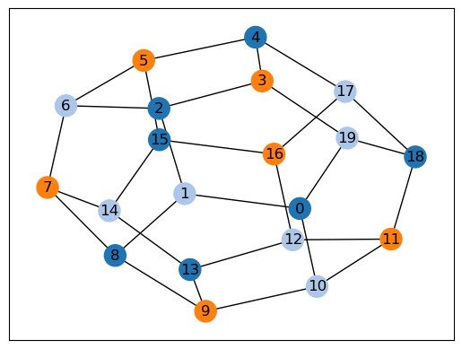

Other layout methods are also available in ``networkx``, such as
``nx.spectral_layout()``,

.. code:: ipython3

    nx.draw_networkx(
        G, 
        pos=nx.spectral_layout(G), 
        node_color=gcol.get_node_colors(G, c)
    )
    plt.show()

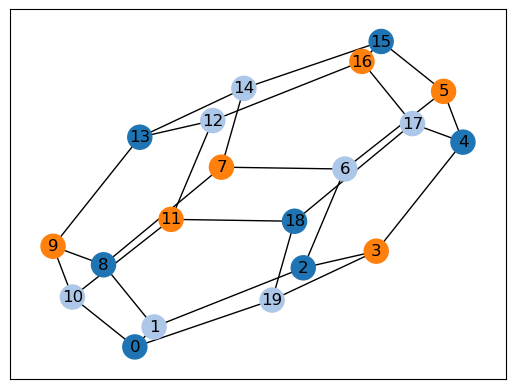

and ``nx.sprial_layout()``.

.. code:: ipython3

    nx.draw_networkx(
        G, 
        pos=nx.spiral_layout(G), 
        node_color=gcol.get_node_colors(G, c)
    )
    plt.show()

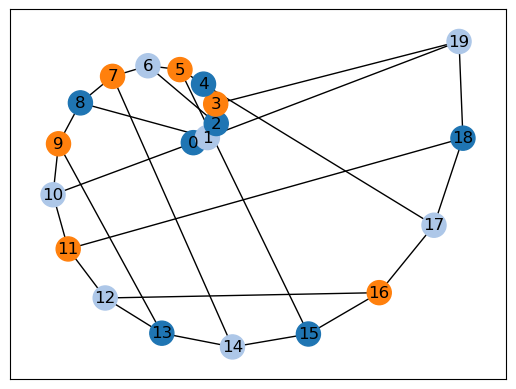

We can also simply place the nodes in random positions, though this may
lead to unclear visualizations.

.. code:: ipython3

    nx.draw_networkx(
        G, 
        pos=nx.random_layout(G, seed=1), 
        node_color=gcol.get_node_colors(G, c)
    )
    plt.show()

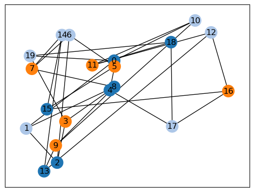

The visualization of graphs becomes more difficult for higher numbers of
nodes and edges, and when the graph features few obvious structural
patterns. The following example illustrates this using a randomly
generated `Erdos-Renyi
graph <https://en.wikipedia.org/wiki/Erd%C5%91s%E2%80%93R%C3%A9nyi_model>`__
:math:`G(50,0.15)`.

.. code:: ipython3

    G = nx.gnp_random_graph(40, 0.15, seed=1)
    c = gcol.node_coloring(G)
    nx.draw_networkx(
        G, 
        pos=nx.spring_layout(G, seed=1), 
        node_color=gcol.get_node_colors(G, c)
    )
    plt.show()

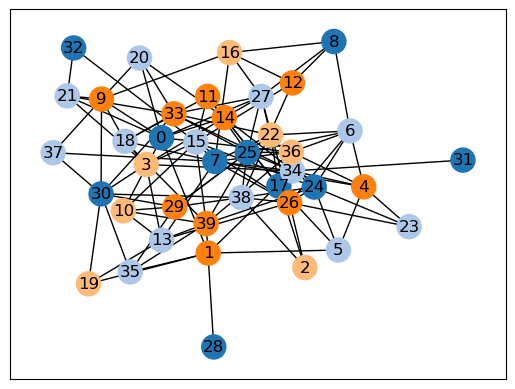

In the above, the ``nx.spring_layout()`` method has given a rather
cluttered layout. Also, the colors of the nodes have not been considered
when determining their positions. Consequently, two alternatives are
offered by the ``gcol`` library. The first of these,
``gcol.multipartite_layout()`` puts the nodes of each color into
columns. The same solution as above is now shown below.

.. code:: ipython3

    nx.draw_networkx(
        G, 
        pos=gcol.multipartite_layout(G, c),
        node_color=gcol.get_node_colors(G, c),
        width=0.5,
        node_size=200,
        font_size=10
    )
    plt.show()

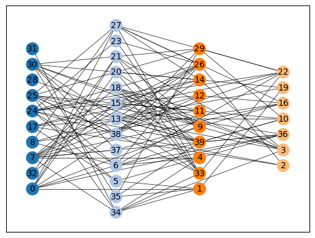

Note that we cannot have vertical edges when using this method of
visualization. It is also clear that each column of nodes corresponds to
an independent set.

The second option is the ``gcol.coloring_layout()`` method. This places
all nodes on the circumference of a circle, with nodes of the same color
in adjacent positions.

.. code:: ipython3

    nx.draw_networkx(
        G, 
        pos=gcol.coloring_layout(G, c),
        node_color=gcol.get_node_colors(G, c),
        width=0.5,
        node_size=200,
        font_size=10
    )
    plt.show()

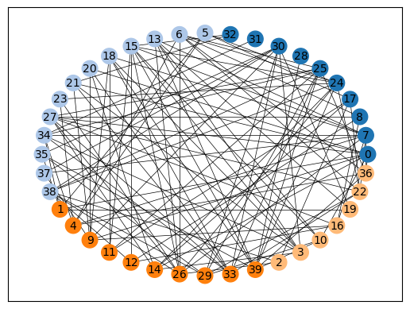

Color Palettes
--------------

So far, the colors used to display the above solutions have been taken
from the in-built default color palette ``gcol.tableau``, which maps the
integers :math:`0,1,2,\ldots` to RGB triplets. This palette is a
collection of 21 colors, provided by Tableau, that are intended to be
aesthetically pleasing and easy on the eye. However, other options are
available in the ``gcol`` library: ``gcol.colorful`` gives a collection
of 57 bright colors that are chosen to contrast each other as much as
possible; ``gcol.colorblind`` gives eleven colors (also provided by
Tableau) that are intended to be easily distinguishable by those with
colorblindness. A demonstration of these palettes is now given.

.. code:: ipython3

    G = nx.dodecahedral_graph()
    c = gcol.node_k_coloring(G, 4)
    nx.draw_networkx(
        G, 
        pos=nx.spring_layout(G, seed=1), 
        node_color=gcol.get_node_colors(G, c, palette=gcol.tableau)
    )
    plt.show()
    
    nx.draw_networkx(
        G, 
        pos=nx.spring_layout(G, seed=1), 
        node_color=gcol.get_node_colors(G, c, palette=gcol.colorful)
    )
    plt.show()
    
    nx.draw_networkx(
        G, 
        pos=nx.spring_layout(G, seed=1), 
        node_color=gcol.get_node_colors(G, c, palette=gcol.colorblind)
    )
    plt.show()

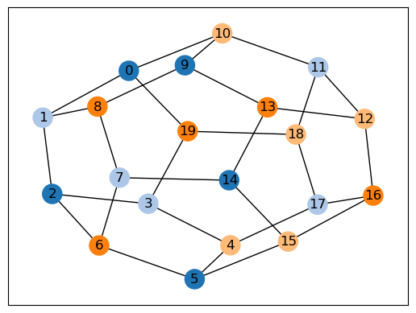

.. image:: output_18_1.png

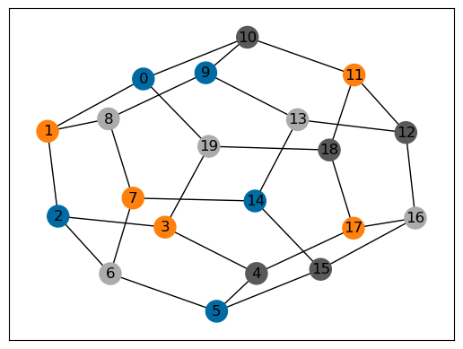

The following shows the colors that are available in each palette. These
are identified by the integers, starting from 0.

.. code:: ipython3

    G = nx.complete_graph(20)
    c = gcol.node_coloring(G)
    nx.draw_networkx(
        G, 
        node_color=gcol.get_node_colors(G, c, gcol.tableau),
        pos=gcol.coloring_layout(G, c),
        node_size=600,
        width=0.00
    )
    print("The (default) gcol.tableau palette (20 colors):")
    plt.show()
        
    G = nx.complete_graph(56)
    c = gcol.node_coloring(G)
    nx.draw_networkx(
        G, 
        node_color=gcol.get_node_colors(G, c, gcol.colorful),
        pos=gcol.coloring_layout(G, c),
        node_size=150,
        font_size=10,
        width=0.00
    )
    print("The gcol.colorful palette (56 colors):")
    plt.show()
        
    G = nx.complete_graph(10)
    c = gcol.node_coloring(G)
    nx.draw_networkx(
        G, 
        node_color=gcol.get_node_colors(G, c, gcol.colorblind),
        pos=gcol.coloring_layout(G, c),
        node_size=800,
        width=0.00
    )
    print("The gcol.colorblind palette (10 colors):")
    plt.show()

.. parsed-literal::

    The (default) gcol.tableau palette (20 colors):
    

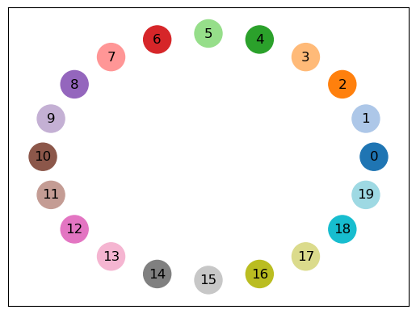

.. parsed-literal::

    The gcol.colorful palette (56 colors):
    

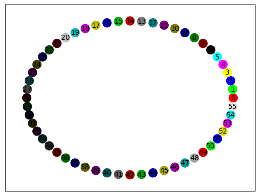

.. parsed-literal::

    The gcol.colorblind palette (10 colors):
    

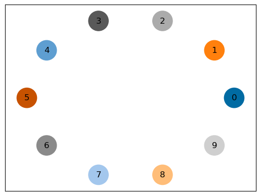

User-defined palettes can also be created. The following demonstrates
how to create a greyscale palette based on the number of colors
:math:`k` in the current solution ``c``.

.. code:: ipython3

    def grayscale(k):
        minVal, maxVal, palette = 0.35, 0.9, {}
        step = (maxVal - minVal) / (k - 1)
        for i in range(k):
            x = minVal + step * i
            palette[i] = (x, x, x)
        palette[-1] = (1.0, 1.0, 1.0)
        return palette
    
    G = nx.dodecahedral_graph()
    c = gcol.node_coloring(G)
    k = max(c.values()) + 1
    print("Custom greyscale palette based on three colors:") 
    nx.draw_networkx(
        G, 
        pos=nx.spring_layout(G, seed=1), 
        node_color=gcol.get_node_colors(G, c, palette=grayscale(k))
    )
    plt.show()

.. parsed-literal::

    Custom greyscale palette based on three colors:
    

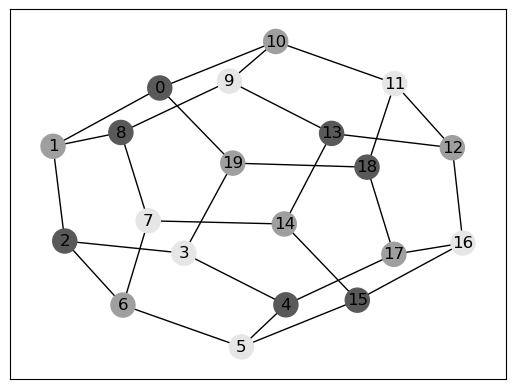

