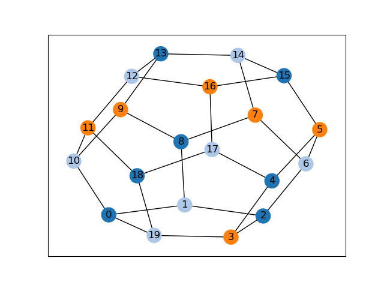

# Summary

Graph colouring is the computational problem of assigning colours to entities of
a graph so that adjacent entities receive different colours. The aim is to use
as few colours as possible. In general terms, a graph is a mathematical object
comprising a set of *nodes* and a set of *edges* that join pairs of nodes.
Graphs are also known as *networks*, nodes as *vertices*, and edges as *links*.
Examples of graph colouring are shown in \autoref{fig:demo}, which help to demonstrate the following principles.

{width="350pt"}

- A *node colouring* is an assignment of colours to the nodes of a graph so that
  adjacent nodes have different colours. The smallest number of colours
  needed for the nodes of a graph $G$ is known as its chromatic number, denoted
  by $\chi(G)$. Identification of $\chi(G)$ is an NP-hard problem.
- An *edge colouring* is an assignment of colours to the edges of a graph so
  that all adjacent edges have different colours. The smallest number of colours
  needed for the edges of a graph $G$ is known at the chromatic index, denoted
  by $\chi'(G)$. According to Vizing's theorem, $\chi'(G)$ is
  either $\Delta(G)$ or $\Delta(G)+1$, where $\Delta(G)$ is the maximum degree
  in $G$. Identifying $\chi'(G)$ is also NP-hard [@Toft2021]. 
- A *face colouring* is an assignment of colours to the faces of a planar
  embedding so that all adjacent faces have different colours. Note that planar
  embeddings only exist for planar graphs. The smallest number of colours needed
  to colour the faces of a planar embedding is known as its face chromatic
  number. Due to the Four Colour Theorem, this number never exceeds four and,
  unlike $\chi(G)$ and $\chi'(G)$, can be determined in polynomial time
  [@Robertson1997].

Graph colouring has applications in many practical areas including timetabling,
sports league scheduling, designing seating plans, code optimisation, and
solving Sudoku puzzles [@Lewis2021Book]. It is also a topic of theoretical
interest [@Cranston2024] that often appears in university-level courses on graph
theory, algorithms, and combinatorics.
  
GCol is a new, open-source Python library for graph colouring that is built on top of
the well-known NetworkX library [@Hagberg2008]. It provides easy-to-use,
high-performance algorithms for the above three problems, as well as routines
for equitable colouring, weighted colouring, pre-colouring, maximum independent
set identification, and solution visualisation. The following code snippet shows
how to use the library to create a dodecahedral graph $G$, colour its nodes
using $\chi(G) = 3$ colours, and then output the solution in textual and
diagrammatic form (see \autoref{fig:snippet}).

```python
>>> import networkx as nx
>>> import matplotlib.pyplot as plt
>>> import gcol
>>> G = nx.dodecahedral_graph()
>>> c = gcol.node_coloring(G)
>>> print("Node coloring of G =", c)
Node coloring of G = {0: 0, 1: 1, 19: 1, 10: 1, 2: 0, 3: 2, 8: 0, 9: 2, 18: 0,
11: 2, 6: 1, 7: 2, 4: 0, 5: 2, 13: 0, 12: 1, 14: 1, 15: 0, 16: 2, 17: 1}
>>> nx.draw_networkx(G, node_color=gcol.get_node_colors(G, c))
>>> plt.show() # See Figure 2
```

{width="300pt"}


# Statement of need

Open-source resources for graph colouring have existed for some time, primarily
for node colouring. An early example is the PL/I code for node colouring
included in the 1979 paper of [@Leighton1979]. Stand-alone C-based
resources were also made available online in the mid-1990s due to 
[@Culberson1994] and [@Trick1994]. A Java-based package implementing the methods of
[@Culberson1994] is now also available [@Shah2020].
  
Graph colouring functionality is also included in some popular open-source C++
libraries. [@Boost] uses a simple constructive heuristic
for node colouring, while the Lemon library [@Dezso2011] includes a method for
colouring the nodes of planar graphs using at most five colours.
[@Goblin] features a similar method to Lemon and, in addition,
includes a mixed integer linear programming approach for exactly solving the
node and edge colouring problems. This algorithm has an exponential time
complexity and, consequently, is unsuitable for larger problem instances. 
  
A further open-source option that, in addition, includes visualisation tools is provided by
SageMath [@sagemath]. This has methods for both node and edge colouring, and can also
enumerate *all* node colourings of a graph. Like Goblin, however, its algorithms
are based on integer programming and operate in exponential time. NetworkX
itself also includes some simple greedy heuristics for node colouring [@Hagberg2008]
as does the alternative Python library Graph-Tool [@Peixoto2014]. In addition, NetworkX
features an exact polynomial-time algorithm for balancing the
number of nodes per colour (equitable node colouring); however, this can only be
applied when the number of available colours exceeds $\Delta(G)$---for fewer
colours, where the problem is NP-hard, no functionality is available. 
  
Further specialised methods for node colouring are also provided by the ColPack software [@Gebremedhin2013]
and in the algorithm suite of [@Lewis2021BookWeb], both
in C++. The algorithms of ColPack are described as "greedy heuristics in the sense that 
the algorithms progressively extend a partial colouring by processing one vertex at
a time, in some order, in each step assigning a vertex the smallest allowable
colour". On the other hand, the suite of [@Lewis2021BookWeb]
features several contrasting algorithms, including constructive heuristics, an
exact algorithm based on backtracking, and bespoke metaheuristics. Finally, 
graph colouring functionality is also provided by the igraph library [@Csardi2005].
The open-source C- and R-based versions of this library use similar greedy heuristics 
to ColPack, whereas the (proprietary) Mathematica version also includes tools for 
edge and face colouring. 
  
The above survey suggests that existing open-source options for graph colouring
are limited. Current resources tend to either use simple constructive heuristics
that lead to low-quality solutions, or exponential-time exact algorithms that
cannot cope with larger graphs. There are also few open-source options for edge colouring,
equitable colouring, and solution visualisation, and, to our knowledge, no
options for face colouring, weighted colouring, or pre-colouring.
  
The GCol library features routines for all of the above. Optimisation is
performed by a choice of node-colouring algorithms that include an exact,
heuristically-guided, exponential-time backtracking algorithm, and several
high-performance polynomial-time heuristics. The latter methods combine fast
constructive methods with contemporary local search heuristics that extend the
C++ implementations of [@Lewis2021BookWeb], allowing high-quality
solutions to be generated in reasonable run times, even for very large graphs.
Edge colourings and face colourings are also determined by these algorithms by
colouring, respectively, the nodes of the corresponding line graphs and dual
graphs. 

The various optimisation algorithms available in the GCol library are described
in detail in its official documentation [@GColDocs] and in the book of
[@Lewis2021Book]. These resources include detailed information on the asymptotic
complexity of all methods used. Results concerning the runtimes and accuracy 
of GCol's algorithms, equitable colouring functionality, and other 
associated optimisation problems are also reported in the documentation.

# References
